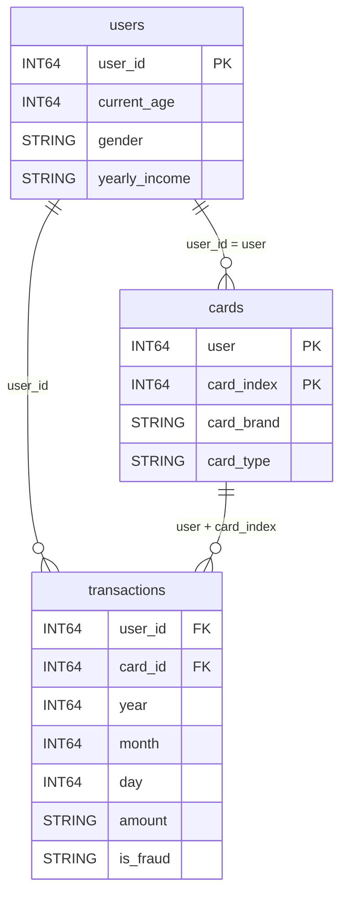

# 데이터와 스키마

이 수업은 기존 FinDA 과정과 같은 카드 거래 데이터를 사용합니다. 원천 프로젝트는 **`finda-13-2026`으로 변경 예정**이며 예제는 데이터셋 이름 `tabformer`를 유지합니다. 실제 공유 완료와 접근 권한은 개강 공지로 확인하세요.

## 데이터가 설명할 수 있는 것

IBM TabFormer의 합성 카드 거래 데이터를 수업용 세 테이블로 읽습니다. 약 2,400만 건은 데이터 규모를 설명하는 값이며, 이번 공유 테이블의 정확한 행 수는 1주차 프로파일링으로 직접 확인합니다. 합성 거래에서 발견한 패턴을 실제 금융 소비자 전체의 성향으로 일반화하지 않습니다.

| 테이블 | 한 행의 의미 | 핵심 키 | 질문 예시 |
| --- | --- | --- | --- |
| `transactions` | 거래 기록 1건 | 제공 스키마에 고유 거래 ID 없음 | 어느 업종의 거래액이 큰가? |
| `users` | 고객 1명 | `user_id` | 고객 속성과 소비 패턴은 어떻게 연결되는가? |
| `cards` | 고객이 보유한 카드 1장 | `user`, `card_index`의 조합 | 보유했지만 거래하지 않은 카드는? |



도식은 수업용 스키마를 단순화한 것입니다. 표시된 키의 유일성과 관계는 실제 테이블에서 검사해야 합니다. 고유 거래 ID가 없으므로 `user_id, card_id, 날짜`만 같다고 중복 거래로 제거하면 안 됩니다. 같은 날 같은 카드로 여러 번 결제할 수 있습니다.

## 이번 강의에서 사용하는 컬럼 계약

아래 목록은 기존 강의의 적재 스키마를 기준으로 합니다. 원본 CSV의 띄어쓰기·대소문자가 포함된 이름과 다를 수 있습니다. 1주차 `INFORMATION_SCHEMA` 결과와 다르면 실제 이름을 기준으로 조정합니다.

### 거래 테이블

| 컬럼 | 타입 | 읽을 때 주의할 점 |
| --- | --- | --- |
| `user_id`, `card_id` | INT64 | `cards.user`, `cards.card_index`와 각각 연결 |
| `year`, `month`, `day` | INT64 | 날짜가 세 컬럼으로 분리되어 있음 |
| `time` | STRING | 시각 문자열이며 날짜를 포함하지 않음 |
| `amount` | STRING | 달러 기호·쉼표가 들어갈 수 있고 음수도 보존 |
| `use_chip` | STRING | 온라인·칩·스와이프 거래 구분 |
| `merchant_name` | STRING | 상점 표시명 대신 식별값이 들어 있음 |
| `merchant_city`, `merchant_state`, `zip` | STRING | 지역 정보, 결측·특수값 확인 |
| `mcc` | INT64 | 가맹점 업종 코드, 임의로 업종 이름 추측 금지 |
| `errors` | STRING | 에러 표기, NULL·공백·실제 값부터 프로파일 |
| `is_fraud` | STRING | 보통 Yes/No, 다른 값은 별도 확인 |

### 고객과 카드 테이블

`users`는 `user_id`, `current_age`, `gender`, `yearly_income`을 주로 씁니다. 소득은 금액 문자열일 수 있습니다. **`current_age`는 스냅샷 시점 속성이며 과거 거래 당시의 나이라고 단정할 수 없습니다.** 나이 구간 분석에는 이 한계를 표시합니다.

`cards`는 `user`, `card_index`, `card_brand`, `card_type`, `credit_limit`을 사용합니다. 고객 A의 카드 0과 고객 B의 카드 0은 다른 카드입니다. `card_index`만으로 조인하면 서로 다른 고객의 카드가 연결될 수 있습니다.

## 공통 정제 표현

1–4주차는 CTE를 이용해 원본을 읽고, 5주차에 같은 규칙을 뷰로 저장합니다. 아래 정제는 값을 조용히 덮어쓰지 않고 **변환 실패를 NULL로 남겨 확인**하는 방식입니다.

```sql
WITH clean AS (
    SELECT
        user_id,
        card_id,
        SAFE.PARSE_DATE(
            '%Y-%m-%d', FORMAT('%04d-%02d-%02d', year, month, day)
        ) AS tx_date,
        SAFE_CAST(REPLACE(REPLACE(amount, '$', ''), ',', '') AS NUMERIC)
            AS amount_usd,
        mcc,
        CASE
            WHEN use_chip = 'Online Transaction' THEN '온라인'
            WHEN use_chip IN ('Swipe Transaction', 'Chip Transaction')
                THEN '오프라인'
            ELSE '미분류'
        END AS channel,
        CASE
            WHEN LOWER(TRIM(is_fraud)) = 'yes' THEN TRUE
            WHEN LOWER(TRIM(is_fraud)) = 'no' THEN FALSE
            ELSE NULL
        END AS fraud_flag,
        errors
    FROM `finda-13-2026.tabformer.transactions`
)
SELECT *
FROM clean
LIMIT 20;
```

이 `LIMIT`는 결과를 살펴보는 용도입니다. 스캔 비용 절감을 보장하지 않습니다. 1주차에는 컬럼을 나눠 읽고, 정제 실패 건수와 원본 예시를 함께 기록합니다.

## 지표에 적용할 교육용 기본값

| 항목 | 기본 정의 | 바꾸는 경우 반드시 기록할 것 |
| --- | --- | --- |
| 분석 기간 | 2018-01-01 이상, 2019-01-01 미만 | 시작일·끝일·완결된 월 여부 |
| 승인 간주 | `errors IS NULL OR TRIM(errors) = ''` | 실제 승인 상태가 아닌 교육용 대리 정의 |
| 순거래액 | 변환 가능한 금액의 합, 음수 포함 | 양수 거래만 포함하면 다른 지표 |
| 거래 건수 | 같은 기간·승인 조건·유효 금액 행 수 | 금액 오류 행 제외 여부 |
| 객단가 | 순거래액 ÷ 위 거래 건수 | 평균의 평균으로 재집계하지 않음 |
| 활성 고객 수 | 같은 범위에서 `COUNT(DISTINCT user_id)` | 집단 간 합산 시 중복 고객 가능 |
| 사기율 | 라벨 TRUE 건수 ÷ TRUE/FALSE 확인 가능 건수 | NULL 라벨을 정상으로 간주하지 않음 |

이 정의는 실제 카드사의 공식 KPI가 아니라 학습을 위한 합의입니다. 2주차에서 다른 정의도 비교하되, 정의가 바뀌면 지표 이름과 분모도 함께 수정하세요.

!!! warning "누락과 0은 다릅니다"
    금액 변환 실패는 0원 거래가 아닙니다. 사기 라벨 누락은 정상 거래가 아닙니다. 한 달의 행이 없다는 사실만으로 실제 거래가 0건이었다고 확정할 수도 없습니다. 데이터 수집 범위를 먼저 확인한 뒤 분석용 달력의 빈 월을 0으로 채웁니다.

## 한 행의 의미가 바뀌는 지점

```text
원본 거래         한 행 = 거래 기록 1건
정제 뷰          한 행 = 거래 기록 1건, 타입과 표준 컬럼 추가
월간 업종 마트   한 행 = 월 × MCC × 채널
대시보드 카드    여러 마트 행을 다시 합산한 지표
```

월간 마트에는 `tx_month`, `mcc`, `channel`, `amount_usd`, `txn_count`, `fraud_count`, `fraud_labeled_count`를 저장합니다. 객단가와 사기율은 **합계 분자 ÷ 합계 분모**로 계산합니다. 마트에는 기본적으로 활성 고객 수를 넣지 않습니다. 업종별 고유 고객 수를 더하면 여러 업종에 방문한 고객이 중복되기 때문입니다.

## 해석할 때 지켜야 할 경계

- 해시처럼 보이는 식별값만으로 실제 상점 이름을 알아낼 수 없습니다.
- 성별·연령대 간 차이는 표본 규모와 사용 빈도 차이도 함께 봅니다.
- 특정 집단의 사기율이 높다는 관찰을 그 집단 전체에 대한 차별적인 심사 근거로 사용하지 않습니다.
- 합성 자료로 배운 패턴을 실제 고객 데이터에 적용할 때는 데이터 권한, 최소 수집, 재식별 위험을 다시 검토해야 합니다.

출처: 제공된 강의계획서 1–5주차, 기존 FinDA Advanced Lesson2의 TabFormer 적재 스키마. [IBM TabFormer](https://github.com/IBM/TabFormer), [SAFE_CAST](https://docs.cloud.google.com/bigquery/docs/reference/standard-sql/conversion_functions), [날짜 함수](https://docs.cloud.google.com/bigquery/docs/reference/standard-sql/date_functions).

