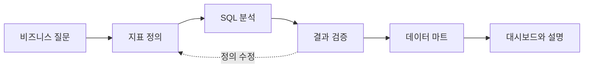

# BigQuery로 배우는 대용량 데이터 분석과 대시보드

**BDAI 13기 프로젝트분반 08** 
금요일 20:00–22:00 / 실시간 온라인 / 총 6회

약 2,400만 건의 연습용 카드 거래 데이터로 “어느 업종에서 많이 쓸까?” 같은 질문에 답해 봅니다. 이 자료는 실제 고객 거래를 그대로 가져온 것이 아니라 인공적으로 만든 합성 데이터입니다. 매주 SQL로 데이터를 조회하고 AI가 만든 코드가 맞는지 확인합니다. 마지막에는 계산 결과를 모은 표와 대시보드를 만들어 포트폴리오로 정리합니다.

[개강 전 준비하기](setup.md){ .md-button .md-button--primary }
[1주차 강의 시작](week1/lecture.md){ .md-button }

## 수업 일정과 결과물

주차는 수업 회차를 뜻합니다. 9월 25일과 10월 9일에는 정규 수업이 없으며, 날짜는 제공된 최종 강의계획서 기준입니다.

| 회차 | 날짜 | 오늘 답할 질문 | 수업 후 남는 자료 |
| --- | --- | --- | --- |
| [1주차](week1/lecture.md) | 9/18 | 이 데이터에 어떤 질문을 할 수 있을까? | 스키마 메모, 프로파일링 SQL, AI 오류 기록 |
| [2주차](week2/lecture.md) | 10/2 | 거래액과 사기율을 어떻게 정의할까? | 지표 정의서, 집계 SQL, 합계가 맞는지 확인 |
| [3주차](week3/lecture.md) | 10/16 | 고객과 카드를 붙여도 숫자가 보존될까? | 조인 SQL, 키와 누락 점검, 주제 후보 |
| [4주차](week4/lecture.md) | 10/23 | 어느 기간과 집단에서 지표가 변했을까? | 분해 분석, 전월비, 프로젝트 중간안 |
| [5주차](week5/lecture.md) | 10/30 | 같은 분석을 적은 반복 작업으로 만들 수 있을까? | 정제 뷰, 월간 마트, 처리 바이트 비교 |
| [6주차](week6/lecture.md) | 11/6 | 검증한 숫자를 다른 사람이 읽을 수 있을까? | Streamlit 앱, 7분 발표, 포트폴리오 |

## 이 자료를 사용하는 순서

각 주차의 **강의 → 실습 → 과제** 순서로 읽으세요. 실습에서 ‘참고 SQL’을 누르면 예제 코드가 펼쳐집니다. 처음에는 그대로 실행해 보고, 익숙해지면 조건을 하나씩 바꾸세요. 그다음 자신의 질문에 맞는 계산 방법과 SQL을 적어 봅니다. SQL 코드 오른쪽 복사 버튼을 사용하고, 실행 전 프로젝트 주소와 처리 바이트를 확인하세요.

수업 전에는 [환경 준비](setup.md)와 [SQL 리프레셔](refresher.md)를 완료합니다. 모든 주차에서 같은 [데이터 가이드](data-guide.md)를 사용합니다. 제출할 때는 [분석 보고서](templates/analysis-report.md)와 [AI 검증 기록](templates/ai-log.md)을 복사해서 작성하세요.

## 수업에서 지키는 분석 원칙

- **질문과 지표부터 정합니다.** 거래액이라는 이름만으로 환불 포함 여부와 분석 기간이 정해지지 않습니다.
- **AI가 만든 숫자도 직접 확인합니다.** 코드가 오류 없이 실행돼도, 우리가 묻는 질문과 다른 계산을 했을 수 있습니다.
- **관찰과 원인을 구분합니다.** 집단 간 차이를 발견해도 원인을 입증한 것은 아닙니다.
- **읽는 곳과 쓰는 곳을 구분합니다.** 강사의 원본 테이블을 읽고, 개인 산출물은 자신의 데이터셋에 만듭니다.

!!! info "실습 환경 안내"
    13기 원본은 `bdai13-bigquery.tabformer`이며 데이터 위치는 `asia-northeast3`입니다. 원본이 보이지 않으면 강사에게 알리고, `YOUR_PROJECT`는 본인 프로젝트로 바꿉니다. [환경 준비](setup.md)에서 주소를 바꾸는 방법과 대시보드를 연결하는 방법을 먼저 확인하세요.

## 과제와 프로젝트

매주 1–2시간 분량의 비즈니스 질문 2–3개를 풉니다. 3주차에는 주제를 논의하고, 4주차부터 [최종 프로젝트](project.md)를 병행합니다. AI를 사용한 부분과 검증 방법을 함께 제출합니다. 과제의 점검표는 학습 피드백 기준이며 학회 공식 성적 배점은 별도 공지를 따릅니다.

프로젝트의 핵심 결과물은 **분석 SQL 세트, 데이터 마트 스크립트, 대시보드 URL**입니다. 게시 전 데이터 공개 범위와 연결 권한을 점검합니다.

## 수강 준비 수준

SELECT, WHERE, GROUP BY, JOIN을 한 번 접했다면 시작할 수 있습니다. Python과 통계 지식, BigQuery와 Streamlit 경험은 필요하지 않습니다. 준비물은 Google 계정, Chrome, 사용할 수 있는 생성형 AI 도구 하나입니다.

출처: 제공된 「BDAI 13기 강의계획서 프로젝트분반 Final」의 교과목 정보, 수업 개요, 주차별 계획. 데이터의 합성 여부: [IBM TabFormer](https://github.com/IBM/TabFormer).
