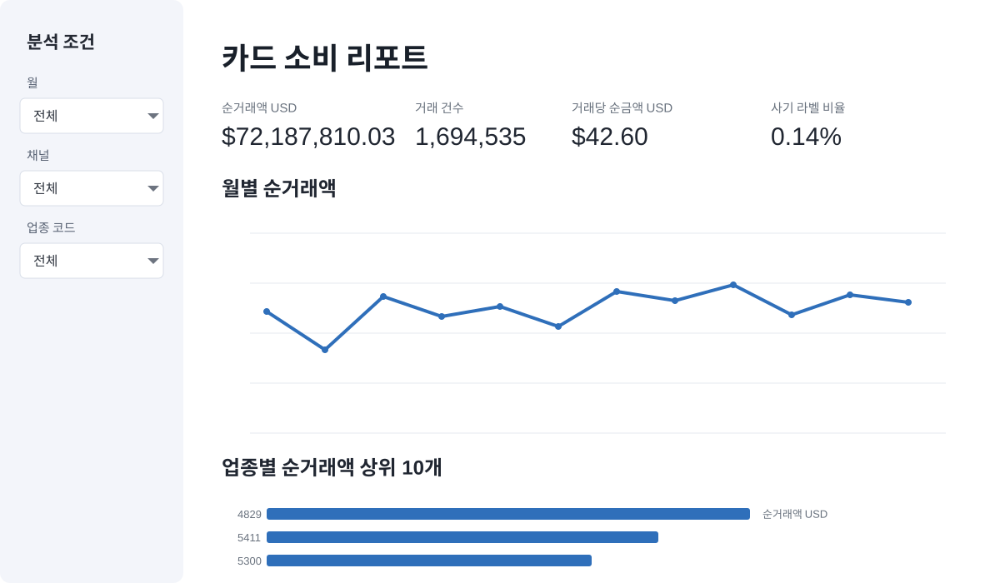

# 최종 프로젝트

질문 하나를 정하고 **계산 기준 정하기 → SQL로 계산하기 → 숫자 확인하기 → 결과를 마트에 저장하기 → Streamlit 화면에 보여 주기** 순서로 프로젝트를 완성합니다. 기능이 많은 앱보다, 표시한 숫자의 근거를 직접 설명할 수 있는 작은 앱을 목표로 합니다.

## Streamlit 앱 예시

아래 이미지를 클릭하면 실제로 실행 중인 예시 앱을 열 수 있습니다. 화면의 필터를 바꾸면서 숫자가 어떻게 달라지는지 확인해 보세요.

[{ loading=lazy }](https://bdai13-card-dashboard.streamlit.app/)

[예시 Streamlit 앱 열기](https://bdai13-card-dashboard.streamlit.app/){ .md-button .md-button--primary }

## 프로젝트의 범위

필수 범위는 질문 1개, 핵심 지표 2–3개, 비교 관점 1–2개, 차트 2개와 필터 1개입니다. Python 문법을 새로 암기하지 않습니다. 강사가 제공한 기본 앱에서 데이터 주소와 화면 요소를 AI와 함께 수정합니다. 추가 모델링, 로그인, 추천 서비스는 이번 과정의 필수가 아닙니다.

| 주제 후보 | 질문 | SQL에서 확인할 것 | 해석의 한계 |
| --- | --- | --- | --- |
| 월간 소비 리포트 | 어느 업종, 채널에서 순거래액이 변했는가? | 월별 합계, 건수, 전월비 | 원인과 관찰을 구분 |
| 채널별 사기 라벨 | 채널별 라벨 비율과 거래 규모는? | 분자와 분모, 미분류 라벨 | 실제 사기 탐지 성능으로 해석하지 않음 |
| 카드 이용 분석 | 보유 카드 중 관측 기간에 미사용인 카드는? | 복합 키, 관측 기간, 사용 기록이 없는 카드 찾기 | 평생 미사용이라고 단정하지 않음 |
| 고객 소비 구성 | 고객 속성별 주요 업종은? | 조인 보존, 그룹 규모, 현재 나이 한계 | 개인의 능력, 성향으로 일반화하지 않음 |

기본 앱은 월간 업종, 채널 마트를 사용합니다. 다른 주제를 고르면 마트의 한 행과 필요한 열을 먼저 정하고, 동일한 검증 기준을 적용합니다.

## 회차별 진행

| 시점 | 할 일 | 보여줄 근거 |
| --- | --- | --- |
| 3주차 끝 | 주제 후보와 조인 경로 논의 | 질문 1문장, 원본, 키 |
| 4주차 | 지표와 첫 분석 결과 작성 | 지표 정의서, SQL, 교차 검증 |
| 5주차 | 재사용할 마트와 앱 연결 준비 | CREATE SQL, 집계 일치, 권한 확인 |
| 6주차 | 앱 수정, 공유, 발표 | 앱 URL, 숫자 대조표, 한계 설명 |

분석한 SQL과 AI가 만든 코드를 확인한 기록은 **각자 남깁니다. 팀에서는 서로 결과를 확인하고 함께 발표**합니다. 팀 인원과 개인 또는 팀 중 어느 단위로 제출할지는 강사 공지를 따릅니다.

## 최소 결과물

```text
project/
  README.md                 질문, 정의, 실행 순서, 앱 URL
  sql/
    01_profile.sql          데이터 범위와 품질 확인
    02_analysis.sql         질문에 답하는 분석
    03_validation.sql       집계, 조인, NULL 검증
    04_mart.sql             마트 생성
  app.py                    Streamlit 화면
  requirements.txt          실행에 필요한 패키지
  ai-log.md                 AI 사용 부분과 검증
```

서비스 계정 키, 비밀번호는 위 폴더나 공개 저장소에 포함하지 않습니다. 직접 연결은 Streamlit의 Secrets 설정을 사용합니다. 자세한 내용은 [앱 데이터 연결](reference/dashboard-connection.md)에 있습니다.

## 7분 발표 구성

| 시간 | 말할 내용 | 화면 |
| --- | --- | --- |
| 0:00–0:45 | 누구의 어떤 질문인가? | 질문과 대상 |
| 0:45–1:45 | 지표, 기간, 포함 조건 | 지표 정의 |
| 1:45–3:15 | 데이터에서 무엇을 관찰했는가? | 차트와 필터 시연 |
| 3:15–4:45 | 숫자를 어떻게 검증했는가? | SQL과 합계 대조 |
| 4:45–6:15 | AI 오류를 어떻게 고쳤는가? | 수정 전후와 근거 |
| 6:15–7:00 | 한계와 다음 질문 | 결론 1문장, 한계 |

아직 실행하지 않았다면 결과 칸을 예상 숫자로 채우지 마세요. 발표에서는 ‘표에서 확인한 사실’과 ‘아직 확인이 필요한 추측’을 나눠 말합니다.

## 제출 전 서로 검토하기

- 다른 사람이 README만 보고 쿼리 실행 순서를 알 수 있나요?
- 앱의 필터를 바꿨을 때 SQL의 동일 조건과 숫자가 일치하나요?
- 사기율, 객단가를 평균의 평균으로 계산하지 않았나요?
- 앱이 2,400만 원본 행을 한꺼번에 읽지 않나요?
- 앱에 보이는 최신 데이터 기준일과 캐시 주기를 알 수 있나요?
- 공개 범위에 개인 행, 작은 집단 정보, 인증키가 포함되지 않나요?
- AI의 도움을 받은 코드와 직접 확인한 근거를 설명할 수 있나요?

## 학습 피드백 기준

| 관점 | 충분히 설명된 결과 | 더 보완할 결과 |
| --- | --- | --- |
| 질문과 정의 | 기간, 한 행의 기준, 분모가 일치함 | 지표 이름만 있고 기준이 없음 |
| SQL | 조인과 집계의 이유를 설명함 | 코드가 실행된다는 말만 있음 |
| 검증 | 기대 조건, 관찰값, 해석이 있음 | “AI가 확인함”으로 끝남 |
| 앱 | 질문에 필요한 차트와 필터가 작동함 | 기능은 많지만 숫자 근거가 없음 |
| 해석 | 관찰, 가설, 한계를 구분함 | 집단 차이를 원인으로 단정함 |

공식 성적 배점표가 아니라 동료 리뷰와 개선을 위한 기준입니다. 학회에서 별도의 평가 방식을 안내하면 그 기준을 따릅니다.

출처: 제공된 강의계획서 3–6주차 및 사용자 추가 지시(6주차 Streamlit, 수강생 대부분 초급).
