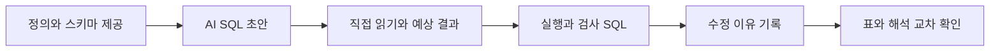

# AI SQL 검증 체크리스트

AI가 만든 SQL을 받을 때마다 아래 순서로 확인합니다. 실행 전에는 실제 열 이름을 썼는지, 실행 후에는 계산한 숫자가 맞는지, 설명을 읽을 때는 표에 없는 말을 더하지 않았는지 봅니다. 이렇게 맞는지 확인하는 과정을 ‘검증’이라고 합니다.

## 실행 전

| 검사 | 질문 | 확인 근거 |
| --- | --- | --- |
| 스키마 | 열 이름, 타입이 실제로 존재하는가? | Schema, INFORMATION_SCHEMA |
| 목적 | 한 행이 무엇을 뜻하는가? | 지표 정의서 |
| 범위 | 날짜, 환불, 오류 거래 조건이 같은가? | WHERE, CTE |
| 조인 | 양쪽 키와 관계가 맞는가? | 키 중복 검사 |
| 비용 | 필요한 열과 범위만 읽는가? | 예상 바이트, 최대 청구 바이트 |

## 실행 후

결과가 자연스러워 보여도 아래 항목을 하나씩 확인하세요.

- 전체 합과 그룹 합이 일치하는가? 같은 고객이 여러 그룹에 들어간다면 그룹별 고객 수를 더했을 때 중복될 수 있습니다.
- LEFT JOIN 전후 거래 행 수와 금액 합이 같은가? 다르면 오른쪽 키 중복부터 확인합니다.
- INNER JOIN으로 없어진 거래는 얼마나 되며 제외할 이유가 있는가?
- SAFE_CAST 실패 건수와 원본 문자열을 확인했는가?
- 비율의 분모가 0 또는 NULL일 때 계산 불가가 표시되는가?
- 사기 라벨의 TRUE, FALSE, NULL이 전체 대상 행을 설명하는가?
- 순위에 동점이 있을 때 결과가 다시 실행해도 안정적인가?
- 전월비의 이전 행이 실제 이전 달인가? 빠진 월이 있지 않은가?

## 해석 후

AI 요약과 결과표를 나란히 놓고 숫자, 증가, 감소 방향, 기준 기간을 대조합니다. “비중이 커졌다”는 말은 절대 거래액 증가와 다릅니다. “전체가 줄었다”는 말은 일부 업종이 늘어난 것과 동시에 성립할 수 있습니다.

| AI 문장 | 확인할 질문 |
| --- | --- |
| A 채널이 더 위험하다 | 표에서 사기 라벨 비율이 높았다는 뜻인가? 그 채널 때문에 위험해진다는 근거도 있는가? |
| 매출이 20% 증가했다 | 분모, 분자, 단위와 비교 월을 실제 표에서 찾을 수 있는가? |
| 고객이 이탈했다 | 실제로 이용을 그만뒀는지 알 수 있는가? 아니면 한동안 거래가 없었다는 뜻인가? |
| 뷰로 바꿔 비용이 절약된다 | 같은 결과에서 처리 바이트를 실제 비교했는가? |

위 문장들은 오류를 찾기 위한 예시이며 실제 데이터 분석 결과가 아닙니다.

## 매주 사용하는 검증 루틴



## 재사용 프롬프트

```text
BigQuery GoogleSQL로 다음 비즈니스 질문에 답하는 쿼리를 작성해 줘.
질문: [질문]
스키마: [실제 열과 타입]
원본: bdai13-bigquery.tabformer.[테이블]
결과 한 행: [한 행의 기준]
기간/환불/오류/NULL 처리: [정의]

1. 먼저 필요한 가정을 설명해 줘.
2. 없는 열이나 결과 숫자를 만들지 마.
3. SQL과 별도로 행 수, 합계, NULL, 조인 검증 쿼리를 제시해 줘.
4. SQL을 단계별로 쉬운 한국어로 설명해 줘.
5. 실행하지 않았다면 검증 완료라고 말하지 마.
```

## Streamlit 코드를 검토할 때

AI에게 한 번에 전체 앱을 다시 쓰게 하지 말고 “기간 필터만 추가”처럼 변경을 작게 요청합니다. 기존 지표 계산, 쿼리 상한, Secrets 사용은 유지하도록 분명하게 적습니다. 수정 전후 동일 조건에서 SQL과 앱 숫자를 대조하고, 데이터 없음, 나누는 수가 0인 경우, 잘못된 연결 설정도 확인합니다. 공개 앱에 임의 SQL 입력창은 넣지 않습니다.

검증 내용을 [AI 기록 양식](../templates/ai-log.md)에 남기세요.

출처: 제공된 강의계획서의 주차별 AI 검증 활동, [BigQuery 쿼리 구문](https://docs.cloud.google.com/bigquery/docs/reference/standard-sql/query-syntax), [Streamlit 캐싱](https://docs.streamlit.io/develop/concepts/architecture/caching).

