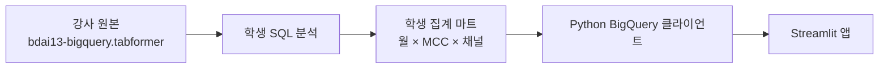
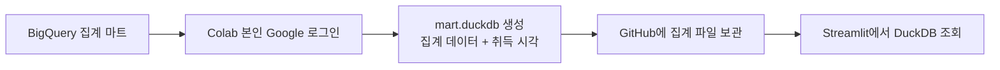

# Streamlit과 데이터 연결

기본 방법은 **BigQuery에 만든 작은 합계 표를 Python으로 읽어 Streamlit 화면에 보여 주기**입니다. 이 합계 표가 5주차의 데이터 마트입니다. CSV로 옮기는 단계는 없습니다. 앱에서 직접 연결할 계정을 만들기 어렵다면, Colab에서 본인 계정으로 로그인해 결과를 DuckDB 파일에 저장하고 앱이 그 파일을 읽게 합니다.

[Streamlit 기본 앱 다운로드](../downloads/streamlit-starter.zip){ .md-button .md-button--primary }
[Colab용 DuckDB 노트북](../downloads/bigquery-duckdb.ipynb){ .md-button }

## 왜 직접 연결을 할 수 있나요?

Google의 BigQuery 클라이언트 라이브러리 빠른 시작은 **결제 등록 없는 샌드박스 사용을 지원**합니다. Data Studio의 BigQuery 커넥터가 결제 연결 프로젝트를 요구하는 것과는 다른 경로입니다. 무료 한도 내에서 쿼리를 실행하며, 무료 한도 초과, 샌드박스 만료, 계정 권한은 따로 관리합니다.



앱은 2,400만 원본 거래를 메모리로 가져오지 않습니다. 5주차에서 만든 작고 검증 가능한 마트만 읽습니다. 원본에서 마트를 만드는 비용과 앱에서 마트를 읽는 비용도 구분합니다.

## 1. 먼저 Colab에서 연결 확인하기

초급 수강생은 Python 설치 없이 Colab에서 아래 순서로 연결을 확인할 수 있습니다. [Google Colab](https://colab.research.google.com/)에서 새 노트북을 열고 각 셀을 차례대로 실행합니다. 이 단계는 직접 연결의 로그인, 쿼리 확인이며 DuckDB가 필수는 아닙니다.

```python
from google.colab import auth
auth.authenticate_user()
```

화면의 Google 계정 로그인을 완료합니다. 토큰이나 인증키를 코드에 붙이지 않습니다.

```python
from google.cloud import bigquery

QUERY_PROJECT = 'YOUR_PROJECT'  # 학생 실행 프로젝트 ID
client = bigquery.Client(project=QUERY_PROJECT)
job = client.query('SELECT 1 AS connected')
print(list(job.result()))
```

`connected=1`이 보이면 다음으로 자신의 집계 마트를 읽습니다. 계정 로그인 성공이 해당 테이블의 조회 권한까지 보장하지는 않습니다.

```python
query = '''
SELECT tx_month, mcc, channel, amount_usd,
       txn_count, fraud_count, fraud_labeled_count
FROM `YOUR_PROJECT.bdai13.mart_monthly_mcc`
WHERE tx_month >= DATE '2018-01-01'
  AND tx_month < DATE '2019-01-01'
'''
config = bigquery.QueryJobConfig(maximum_bytes_billed=100_000_000)
job = client.query(query, job_config=config, location='asia-northeast3')  # 마트의 실제 리전
df = job.result().to_dataframe(create_bqstorage_client=False)
display(df.head())
print('집계 행 수:', len(df), '처리 바이트:', job.total_bytes_processed)
```

제공된 기본 앱에는 조회 기간을 안전하게 전달하는 설정(매개변수), 가져올 행 수 제한, 이전 결과를 잠시 다시 쓰는 기능(캐시)이 더해져 있습니다. `maximum_bytes_billed`는 1회 쿼리 상한이고, `LIMIT`는 반환 행 제한입니다. 역할이 다릅니다.

## 2. 공개 앱의 인증 준비

Colab에서는 사람이 직접 Google 로그인합니다. 공개 앱 서버는 대신 **서비스 계정**이라는 프로그램용 계정으로 데이터를 읽습니다. 앱 방문자마다 BigQuery 권한을 부여하는 방식은 이번 기본 실습에 포함하지 않습니다.

| 설정 | 범위 | 준비 주체 |
| --- | --- | --- |
| BigQuery API 활성화 | 쿼리를 실행할 프로젝트 | 프로젝트 소유자 |
| BigQuery Job User | 실행 프로젝트 | 학생 또는 강사 관리 계정 |
| BigQuery Data Viewer | 공개 가능한 집계 마트 테이블 | 마트 소유자 |
| 서비스 계정 인증정보 | Streamlit Secrets | 해당 학생/강사 |

**원본 전체 읽기 권한이나 프로젝트 Owner를 앱에 부여하지 않습니다.** 이 앱은 저장된 집계 테이블을 읽으므로 해당 테이블에 필요한 조회 권한만 줍니다. 한 서비스 계정 키를 반 전체에 공용으로 배포하지 않고 학생, 팀별 구성을 사용합니다. 교사는 화면 순서 안내와 템플릿을 제공하고 실제 키는 각자 Secrets에 입력합니다.

조직 정책으로 서비스 계정 키 생성이 차단되어 있으면 정책을 끄는 실습을 하지 않습니다. Colab에서 본인 계정의 조회가 가능하면 아래 DuckDB 경로를 이용합니다. 본인 계정도 원본, 마트 조회 권한이 없다면 먼저 그 권한부터 해결해야 합니다.

## 3. 기본 앱의 설정값

압축을 풀고 `.streamlit/secrets.toml.example`을 읽습니다. 로컬에서는 같은 폴더의 `secrets.toml`에, Community Cloud에서는 앱의 Secrets 화면에 입력합니다.

```toml
[data]
backend = "bigquery"
query_project = "YOUR_PROJECT"
table = "YOUR_PROJECT.bdai13.mart_monthly_mcc"
location = "US"
maximum_bytes_billed = 100000000
```

Google에서 받은 서비스 계정 JSON은 앱이 로그인할 때 쓸 정보를 담은 파일입니다. 파일 안의 항목 이름과 값을 예제의 `[gcp_service_account]` 아래에 맞춰 입력합니다. 줄바꿈이 포함된 private_key는 예제 양식에 맞춰 입력합니다. **실제 키를 GitHub에 올리거나 AI에게 보내지 않습니다.** 프로젝트 ID, 테이블 ID, 리전만 AI에 알려 주면 코드 수정에 충분합니다.

5주차 마트의 필수 열은 `tx_month`, `mcc`, `channel`, `amount_usd`, `txn_count`, `fraud_count`, `fraud_labeled_count`입니다. 이름을 바꾸면 코드도 함께 수정해야 합니다. `YOUR_PROJECT`는 학생마다 달라지며 강사 원본 ID를 무조건 넣는 칸이 아닙니다.

## 4. GitHub에서 Community Cloud로 배포

1. 기본 앱 압축 안의 파일들을 자신의 새 GitHub 저장소에 넣습니다. 숨김 폴더 `.streamlit`의 `config.toml`도 포함합니다.
2. [Streamlit Community Cloud](https://share.streamlit.io/)에 GitHub 계정으로 연결합니다.
3. 저장소, 브랜치, `app.py`를 선택합니다. 제공 requirements와 호환되는 Python 3.12 이상을 선택합니다.
4. Secrets에 연결 설정과 본인 인증정보를 입력합니다.
5. 배포 후 생성된 앱 URL에서 월, 채널, MCC 필터를 바꾸고, SQL과 동일 조건의 합계를 대조합니다.

공개 앱에는 집계 데이터도 방문자에게 공개됩니다. 공개 가능한 집계만 연결하고, 시연용 앱의 무료 한도 소진과 휴면, 자원 제한을 고려하세요. 앱의 캐시는 최대 10분이며 무제한 실시간 갱신이 아닙니다. 앱에서 보이는 데이터 취득 시각과 마트의 최신 작성 시각도 구분합니다.

이 강의 사이트는 미리 만든 글과 그림을 보여 주는 GitHub Pages에서 열립니다. Python을 실행하는 Streamlit 앱은 Community Cloud에 따로 올립니다. 앱 주소가 생기면 강의 사이트에서 그 주소로 연결할 수 있습니다.

## 5. 예비 경로 Colab + DuckDB



DuckDB는 여러 표를 파일 하나에 담아 SQL로 읽을 수 있는 도구입니다. 제공 노트북을 Colab에 업로드하고 다음 순서로 실행합니다.

1. 패키지 설치 셀 실행.
2. 본인 Google 로그인.
3. 실행 프로젝트, 집계 마트, 리전 입력.
4. BigQuery에서 집계 결과를 DataFrame으로 가져오기.
5. DuckDB 파일의 `mart_monthly_mcc`와 `snapshot_metadata` 테이블 생성.
6. 행 수, 금액 합, 분모 합 대조 후 `mart.duckdb` 다운로드.
7. 공개 가능한 파일인지 확인하고 앱 저장소의 가장 바깥 폴더, 즉 `app.py`와 같은 위치에 추가.

앱 Secrets를 다음처럼 바꾸면 같은 화면을 사용합니다.

```toml
[data]
backend = "duckdb"
snapshot = "mart.duckdb"
```

**수동 CSV 단계는 없습니다.** DuckDB 파일은 사진처럼 저장한 때의 결과를 담은 사본입니다. 이런 사본을 스냅샷이라고 합니다. 새 데이터를 반영하려면 노트북을 다시 실행해 파일을 교체합니다. Colab을 상시 웹서버로 열거나 외부 터널로 Streamlit을 호스팅하는 방식은 사용하지 않습니다. 노트북은 데이터 준비, Community Cloud는 앱 공개를 담당합니다.

DuckDB는 BigQuery의 조회 권한이나 무료 쿼리 한도를 없애 주지 않습니다. BigQuery 자체 조회가 실패하면 원본 파일을 별도로 확보해야 하며, 존재하지 않는 데이터를 DuckDB로 연결할 수는 없습니다.

## 수업 전 확인할 세 가지

- 학생 계정으로 `SELECT 1`과 마트 조회가 되는가?
- 직접 연결용 서비스 계정을 사용할 수 있는가? 어려우면 Colab 조회→DuckDB 경로는 되는가?
- 필터를 바꿨을 때 SQL과 앱의 합계, 분모가 일치하는가?

출처: [BigQuery Python, 샌드박스](https://docs.cloud.google.com/bigquery/docs/quickstarts/quickstart-client-libraries), [Streamlit BigQuery 연결](https://docs.streamlit.io/develop/tutorials/databases/bigquery), [무료 배포](https://docs.streamlit.io/deploy/streamlit-community-cloud), [DuckDB Python](https://duckdb.org/docs/stable/clients/python/overview.html), [Colab FAQ](https://research.google.com/colaboratory/faq.html).
