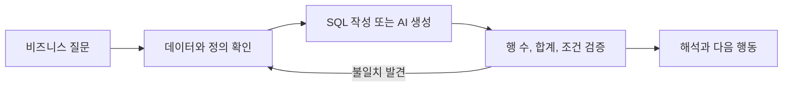
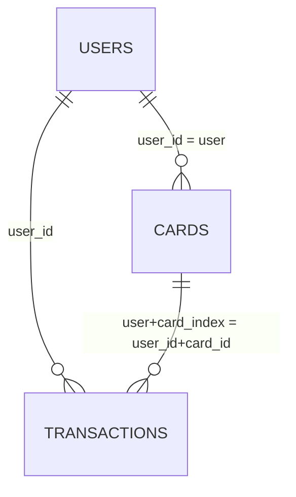
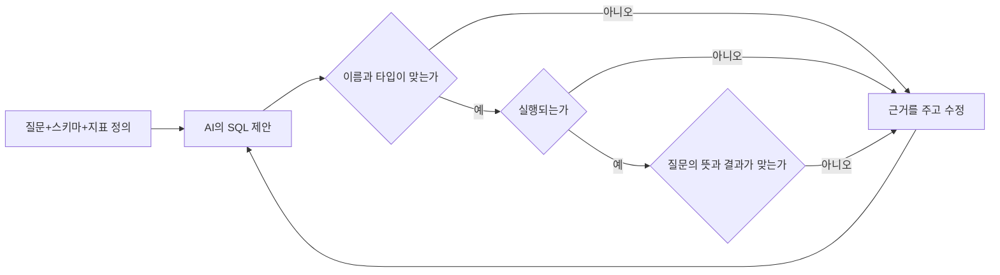

# 1주차 / BigQuery 첫걸음과 AI SQL의 원리

2026년 9월 18일 금요일 20:00–22:00 / 120분

오늘의 질문은 **“이 데이터로 어떤 분석을 시작할 수 있으며, 계산을 믿기 전에 무엇을 확인해야 할까?”**입니다. 쿼리를 처음 실행하는 데서 멈추지 않고, 다음 사람이 분석을 이어 갈 수 있는 데이터 점검표를 만듭니다.

[실습으로 이동](lab.md) / [과제](assignment.md) / [접속 준비](../setup.md) / [데이터 사전](../data-guide.md)

## 오늘 할 수 있게 되는 일

- 프로젝트, 데이터셋, 테이블과 쿼리 실행 프로젝트를 구분합니다.
- 세 테이블의 한 행이 무엇을 뜻하는지 설명합니다.
- 실행 전 예상 처리 바이트와 실행 후 작업 정보를 기록합니다.
- 행이 몇 개인지, 날짜와 금액을 읽을 수 있는지, 비어 있는 값이 있는지 확인합니다.
- AI가 실제 열 이름을 썼는지, 코드가 실행되는지, 질문에 맞게 계산했는지 확인합니다.

| 시간 | 내용 | 방식 |
|---|---|---|
| 20:00–20:10 | 분석가의 질문과 6주 결과물 | 설명, 대화 10분 |
| 20:10–20:25 | BigQuery 구조와 비용 | 설명 15분 |
| 20:25–20:45 | A. 접속, 스키마, 첫 쿼리 | 실습 20분 |
| 20:45–21:10 | B. 데이터 프로파일링 | 실습 25분 |
| 21:10–21:15 | 쉬는 시간 | 5분 |
| 21:15–21:30 | LLM의 생성 원리와 오류 | 설명 15분 |
| 21:30–21:55 | C. AI SQL 만들기, 확인하기, 고치기 | 실습 25분 |
| 21:55–22:00 | 발견 공유와 과제 안내 | 정리 5분 |

실습은 총 70분입니다. 이번 주에는 Python을 사용하지 않습니다. 처음에는 완성된 SQL을 실행한 뒤 열 이름이나 조건 한 부분씩 바꿉니다. 필수 실습을 마친 사람만 도전 활동으로 이동합니다.

## 1. 분석은 질문을 구체화하는 일이다

“매출을 분석해 주세요”만으로는 SQL을 정하기 어렵습니다. 거래액인지 수수료 수익인지, 환불을 포함하는지, 어느 기간을 비교하는지에 따라 다른 답이 나옵니다. 이 데이터에는 카드 거래 금액이 있으며 기업의 매출 전체가 들어 있다고 보장할 수 없습니다. 그래서 첫 질문을 “2018년 거래 금액을 업종별로 비교할 수 있을까?”로 좁힙니다.

답을 찾으려면 날짜와 금액을 읽을 수 있어야 하고, 업종을 나타내는 번호인 MCC가 무엇인지 알아야 합니다. **오늘은 순위를 만들기 전에 재료를 확인합니다.** 다음 주에는 계산 기준을 정하고 같은 항목끼리 묶어 합계를 구하는 ‘집계’를 배웁니다. 이후에는 고객과 카드 정보를 붙이고, 기간과 그룹을 나눠 차이를 살펴봅니다. 마지막에는 자주 볼 결과를 작은 표에 저장하고 차트로 보여 줍니다.



IBM TabFormer의 카드 거래 자료는 합성 데이터입니다. 강의계획서의 약 2,400만 건은 규모를 설명한 값이며, 이번에 공유된 테이블의 정확한 행 수는 직접 확인합니다. 분석 결과를 실제 카드사 고객의 행동이나 시장 전체의 사실로 일반화하지 않습니다. [IBM 원본 저장소](https://github.com/IBM/TabFormer)

## 2. BigQuery는 어디서 읽고 어디서 실행할까?

엑셀 파일을 내 컴퓨터에 내려받아 열지 않고, 클라우드에 있는 테이블을 SQL로 조회합니다. 서버를 직접 설치하거나 Python을 준비할 필요는 없습니다. 테이블의 주소는 `프로젝트.데이터셋.테이블`입니다.

| 구분 | 이번 수업의 표현 | 의미 |
|---|---|---|
| 원본 프로젝트 | `finda-13-2026` | 강사가 공유하는 데이터가 있는 위치 |
| 원본 데이터셋 | `tabformer` | 세 테이블을 모아 둔 단위 |
| 원본 테이블 | `transactions` | 개별 거래 기록 |
| 내 실행 프로젝트 | `YOUR_PROJECT` | 내가 쿼리를 실행하는 프로젝트 |
| 내 데이터셋 | `bdai13` | 5주차부터 뷰, 마트를 저장할 곳 |

원본 주소는 `finda-13-2026.tabformer`입니다. [접속 준비](../setup.md)에서 공유 권한과 데이터 위치를 확인합니다. 원본의 소유 프로젝트와 쿼리를 실행하는 프로젝트가 다를 수 있다는 점을 기억합니다.

1–4주차에는 SELECT와 CTE로 조회합니다. 오늘 테이블을 복제하거나 새 뷰를 만들 필요는 없습니다. CTE는 `WITH`로 이름을 붙인 중간 결과이며, **현재 쿼리 한 문장 안에서만** 사용할 수 있습니다.

## 3. 결과가 10행이면 읽은 데이터도 10행일까?

아닐 수 있습니다. 조회한 양에 따라 계산하는 요금 방식(온디맨드)에서는 읽은 데이터 크기가 비용과 관련됩니다. 바이트는 이 크기를 나타내는 단위입니다. 일반 비클러스터 테이블의 `LIMIT 10`은 화면에 돌려주는 행 수를 제한하지만 스캔 비용을 줄이는 장치가 아닙니다. 테이블 미리보기로 값을 먼저 살피고, 필요한 열만 선택한 뒤 예상 처리 바이트를 확인합니다. [비용 추정과 통제](https://docs.cloud.google.com/bigquery/docs/best-practices-costs)

교육용 가정으로 열 하나를 읽는 양이 1 GiB인 테이블에서 열 10개를 모두 읽으면 약 10 GiB를 읽을 수 있습니다. 이는 열 크기가 같다고 둔 손계산이며 실제 테이블의 크기가 아닙니다. 쿼리 A와 B의 예상 바이트를 직접 비교해야 효과를 알 수 있습니다.

| 실행 전후 | 기록할 것 | 이유 |
|---|---|---|
| 실행 전 | 조회 주소와 선택 열 | 엉뚱한 데이터 조회 방지 |
| 실행 전 | 예상 처리 바이트 | 사용량을 보고 실행 결정 |
| 실행 전 | Maximum bytes billed | 쿼리별 청구 바이트 상한 확인 |
| 실행 후 | 읽은 데이터 크기, 요금 계산에 쓰인 크기, 이전 결과 재사용 여부(캐시) | 실제 작업 정보 확인 |
| 실행 후 | 결과 행 수 | 출력 크기와 스캔 크기 구별 |

쿼리 설정에서 `Maximum bytes billed`를 찾아 바이트 단위 상한을 지정할 수 있습니다. 단순히 예상치보다 무조건 크게 설정하지 말고, 강사가 제시한 실습 한도 안에 들어오는지 먼저 확인합니다. 예산 알림은 알림이며 쿼리를 자동 차단하는 장치로 취급하지 않습니다.

BigQuery sandbox는 결제 등록 없이 시작할 수 있고, 월 1 TiB 쿼리 처리와 10 GiB 저장 무료 한도를 제공합니다. 테이블 등에는 60일 만료와 기능 제한이 있으므로, 무료라는 이유로 무제한 실행하지 않습니다. 오늘의 읽기 실습과 이후 저장 계획은 [sandbox 공식 안내](https://docs.cloud.google.com/bigquery/docs/sandbox)를 기준으로 진행합니다.

## 4. 세 테이블의 ‘한 행’을 먼저 읽는다

| 테이블 | 한 행의 의미 | 확인할 키 | 주의할 점 |
|---|---|---|---|
| `users` | 사용자 한 명의 속성 | `user_id` | `current_age`는 고객 정보를 저장할 때의 나이 |
| `cards` | 사용자가 가진 카드 하나 | `(user, card_index)` | 다른 고객도 같은 카드 번호를 가질 수 있음 |
| `transactions` | 거래 기록 한 행 | 고유 거래 ID 없음 | 같은 사용자, 카드가 반복 등장 |



위 그림처럼 표 사이의 연결 관계를 보여 주는 그림을 ERD라고 합니다. 고객 번호가 겹치지 않는지, 고객 번호와 카드 번호를 함께 묶으면 카드 한 장을 구별할 수 있는지 직접 확인해야 합니다. 조인은 3주차에 다루며, 오늘은 키를 읽고 기록하는 데 집중합니다.

### 손으로 읽어 보는 교육용 가상 데이터

| user_id | card_id | year | month | day | amount | use_chip | errors |
|---|---|---|---|---|---|---|---|
| 7 | 0 | 2018 | 1 | 2 | `$100.00` | Online Transaction | NULL |
| 7 | 0 | 2018 | 1 | 2 | `$-20.00` | Online Transaction | 빈 문자열 |
| 8 | 0 | 2018 | 2 | 30 | `unknown` | Chip Transaction | Insufficient Balance |

세 행의 금액을 바로 더할 수는 없습니다. `amount`는 문자열이며 `$`와 쉼표를 제거한 뒤 숫자로 변환해야 합니다. 첫 두 행만 유효한 금액이라면 합은 80달러입니다. 음수를 환불로 포함한 **순거래액**이라는 설명이 필요합니다. 세 번째 행을 0달러라고 바꾸면 잘못된 금액을 정상 거래처럼 세게 됩니다.

날짜도 문자열을 붙이는 것으로 끝나지 않습니다. 2018년 2월 30일은 존재하지 않으므로 안전한 날짜 변환에서 NULL이 되어야 합니다. `merchant_name`은 읽을 수 있는 상점 이름이라고 가정하지 않고 식별값으로 취급합니다. MCC는 업종 코드이며 그 자체가 상점 이름이 아닙니다.

## 5. 프로파일링은 분석의 전제를 적는 과정이다

프로파일링은 분석 전에 데이터의 상태를 살펴보는 일입니다. 표가 몇 줄인지, 서로 다른 값이 몇 개인지, 값이 숫자인지 글자인지, 비어 있는 곳은 없는지 확인합니다. 비어 있거나 알 수 없는 값을 ‘결측’이라고 부릅니다. 숫자를 많이 뽑는 것이 목적은 아닙니다. “금액 변환 실패가 있는가?”, “분석하려는 기간이 실제로 존재하는가?”, “고객과 카드 키를 믿을 수 있는가?”를 답해야 합니다.

`COUNT(*)`는 모든 행을 셉니다. `COUNT(amount)`는 `amount`가 NULL이 아닌 행을 셉니다. 빈 문자열은 NULL이 아니므로 별도로 확인합니다. `COUNTIF(조건)`은 조건이 TRUE인 행의 개수입니다.

```sql
-- 교육용 가상 데이터: 원본 테이블 접속 없이 실행할 수 있습니다.
WITH sample AS (
  SELECT '$100.00' AS amount UNION ALL
  SELECT '' UNION ALL
  SELECT CAST(NULL AS STRING)
)
SELECT
  COUNT(*) AS all_rows,
  COUNT(amount) AS non_null_rows,
  COUNTIF(amount IS NULL OR TRIM(amount) = '') AS missing_or_blank_rows
FROM sample;
```

예상 결과는 전체 3행, NULL이 아닌 값 2개, NULL 또는 빈 문자열 2개입니다. `COUNT(amount)`가 정상적인 금액 개수는 아니라는 사실을 확인합니다. 실제 데이터 결과와 이 손계산 예시를 섞어서 기록하지 않습니다.

## 6. LLM은 왜 SQL을 만들 수 있고 왜 틀릴까?

LLM은 많은 글과 코드에서 말이 이어지는 방식을 배운 AI입니다. 우리가 질문과 표의 구조를 알려 주면, 그 내용에 이어질 만한 코드 조각을 차례로 만들어 SQL을 제안합니다. 이때 다루는 글의 조각을 ‘토큰’이라고 합니다. 그럴듯한 코드를 만들어도 우리 데이터의 열 이름이나 계산 기준을 잘못 짐작할 수 있으므로 직접 확인해야 합니다. [Google의 언어 모델 기초](https://developers.google.com/machine-learning/crash-course/llm)

일반 대화창에 질문만 보내면 AI가 우리의 BigQuery 테이블을 자동으로 읽었다고 가정할 수 없습니다. “월별 거래액”이라는 말에서 `transaction_date`라는 흔한 이름을 추측해 만들 수 있습니다. 우리 데이터에는 `year`, `month`, `day`가 따로 있으므로 그 쿼리는 실패합니다. 이 사례는 학습용 실패 예시이며 특정 서비스가 항상 같은 오류를 낸다는 뜻은 아닙니다.



| 오류 수준 | 예시 | 검증 방법 |
|---|---|---|
| 스키마 | 없는 `transaction_date`를 사용 | 실제 열 이름과 대조 |
| 타입 | 문자열 `amount`를 `SUM` | 데이터형과 정제식 확인 |
| 의미 | 오류 기록까지 승인 거래로 계산 | 지표 정의와 WHERE 비교 |
| 해석 | 상위 업종을 “수익성이 가장 높음”으로 표현 | 계산한 지표와 주장 비교 |

오류 메시지를 지우기만 하는 수정은 충분하지 않습니다. `SUM`이 실패하자 `COUNT(*)`로 바꾸면 실행은 되지만 거래액이라는 질문이 거래 건수로 바뀝니다. “무엇을 바꿨으며 질문은 그대로인가?”를 함께 확인합니다.

## 마무리

오늘의 제출물은 실행한 SQL, 처리 바이트 기록, 데이터 함정 세 가지, AI가 생성한 부분과 검증 방법입니다. 좋은 첫 분석은 “데이터가 깨끗하다”라는 선언보다 “어떤 조건과 한계를 확인했다”라는 기록을 남깁니다. 다음 주에는 이 기록을 [지표 정의서](../templates/metric-spec.md)로 연결합니다.

출처: 제공된 강의계획서 1주차; [IBM TabFormer](https://github.com/IBM/TabFormer), [BigQuery 비용 통제](https://docs.cloud.google.com/bigquery/docs/best-practices-costs), [Sandbox](https://docs.cloud.google.com/bigquery/docs/sandbox), [Google 언어 모델 기초](https://developers.google.com/machine-learning/crash-course/llm).
