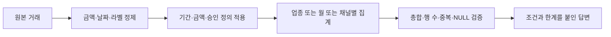

# 2주차 · 비즈니스 질문을 지표와 집계로 바꾸기

2026년 10월 2일 금요일 20:00–22:00 · 120분

오늘의 질문은 **“같은 데이터를 계산했는데 왜 팀마다 숫자가 다를까?”**입니다. 수식을 고치기 전에 대상·기간·분모·제외 조건이 같은지 확인합니다.

[실습](lab.md) · [과제](assignment.md) · [지표 정의서](../templates/metric-spec.md) · [데이터 사전](../data-guide.md)

## 오늘의 진행

| 시간 | 내용 | 방식 |
|---|---|---|
| 20:00–20:15 | 질문과 지표 정의, 손계산 | 설명·함께 계산 15분 |
| 20:15–20:30 | 정제 CTE와 집계 패턴 | 설명 15분 |
| 20:30–20:55 | A. 업종별 Top 10과 총합 | 실습 25분 |
| 20:55–21:15 | B. 2018년 월별 추이 | 실습 20분 |
| 21:15–21:20 | 쉬는 시간 | 5분 |
| 21:20–21:30 | 사기율 분모와 AI 오류 | 설명 10분 |
| 21:30–21:55 | C. 채널 사기율·검증 | 실습 25분 |
| 21:55–22:00 | 발견 공유와 과제 | 정리 5분 |

실습은 70분입니다. 처음에는 완성 SQL에서 정렬이나 그룹 열 한 부분씩 바꿉니다. 필수 활동을 끝내면 선택 도전으로 이동합니다.

## 1. 지표 정의서는 SQL의 설계도다

“거래액이 큰 업종”은 투자할 만한 업종, 수익성이 높은 업종과 같은 말이 아닙니다. 이 수업은 관찰된 거래 금액을 집계합니다. 수익성 판단에는 수수료·비용·손실 등 다른 정보가 필요합니다.

지표 정의서에는 이름보다 **무엇을 포함하고 무엇을 제외하는지**를 먼저 씁니다. “2018년 승인 거래”라는 표현도 데이터에 실제 승인 상태가 있는지 확인해야 합니다.

이번 주에는 `errors`가 NULL 또는 공백인 행을 승인으로 간주합니다. 이는 교육용 분석 정의이며 실제 카드 승인 상태와 동일하다고 보장하지 않습니다. 조건을 바꾸면 결과가 달라지므로 모든 쿼리에서 같은 정의를 사용합니다.

| 항목 | 이번 주 공통 정의 |
|---|---|
| 기간 | 유효 날짜가 2018-01-01 이상, 2019-01-01 미만 |
| 금액 | `$`와 쉼표 제거 후 NUMERIC 변환에 성공한 값 |
| 승인 범위 | errors가 NULL 또는 TRIM 후 빈 문자열인 행 |
| 환불 | 음수 금액을 포함하므로 순거래액으로 명명 |
| 거래 건수 | 위 조건을 만족하는 거래 행 수 |
| 객단가 | 순거래액 / 거래 건수, 즉 거래 1건당 평균 금액 |
| 활성 고객 수 | 같은 범위에서 거래한 DISTINCT user_id 수 |
| 사기율 | 사기 Yes 건수 / Yes·No로 해석되는 라벨 건수 |
| 미분류 채널·MCC 결측 | 숨기지 않고 별도 그룹으로 유지 |

실무에서 “객단가”는 다른 의미로 쓰일 수 있으므로 분모를 반드시 적습니다. 이번 수업의 객단가는 고객 1명당 금액이 아닙니다. 활성 고객 수는 월이나 업종별 값을 더해 전체로 만들 수 없습니다. 같은 사람이 여러 월·업종에 나타날 수 있기 때문입니다.



## 2. 손으로 먼저 계산하는 교육용 가상 예시

아래는 원본 조회 결과가 아닌 가상 데이터입니다. 날짜는 모두 유효한 2018년 날짜이며, A–D의 errors는 NULL이라고 가정합니다.

| 행 | 사용자 | 채널 | amount | 사기 라벨 | errors |
|---|---|---|---|---|---|
| A | 1 | 오프라인 | `$100.00` | No | NULL |
| B | 1 | 온라인 | `$60.00` | No | NULL |
| C | 2 | 온라인 | `$-20.00` | Yes | NULL |
| D | 3 | 오프라인 | `$40.00` | NULL | NULL |
| E | 4 | 온라인 | `unknown` | No | NULL |
| F | 4 | 온라인 | `$200.00` | Yes | Declined |

계산 전에 E는 금액을 해석할 수 없어 제외하고, F는 교육용 승인 조건을 만족하지 않아 제외합니다. 나머지는 4행입니다. A–D의 순거래액은 100 + 60 − 20 + 40 = 180달러, 거래 건수는 4건, 객단가는 45달러입니다. 활성 고객 수는 사용자 1·2·3의 3명입니다.

사기 라벨을 아는 행은 A·B·C의 3건이고 그중 Yes가 C 한 건이므로 사기율은 1/3입니다. D는 사기가 아니라고 확인된 행이 아니라 **라벨을 모르는 행**입니다. D까지 분모에 넣으면 다른 지표인 전체 거래 대비 확인된 사기 비중 1/4가 됩니다.

채널별로는 온라인이 사기 1/라벨 2 = 50%, 오프라인은 0/1 = 0%입니다. 두 비율의 단순 평균 25%는 전체 1/3과 다릅니다. 전체 사기율은 분자끼리 더하고 분모끼리 더한 뒤 나눕니다. 이후 데이터 마트에도 분자와 분모를 남기는 이유입니다.

## 3. 정제는 잘못된 값을 숨기지 않는 변환이다

### 금액: 문자열을 숫자로

```sql
SELECT
  raw_amount,
  SAFE_CAST(REPLACE(REPLACE(raw_amount, '$', ''), ',', '') AS NUMERIC)
    AS amount_usd
FROM UNNEST(['$1,234.56', '$-20.00', 'unknown', '']) AS raw_amount;
```

이 쿼리는 교육용 가상 값을 사용합니다. 결과는 각각 1234.56, -20, NULL, NULL입니다. 바깥쪽 `REPLACE`가 쉼표를 없애고 안쪽 `REPLACE`가 `$`를 없앤다는 식으로, 가장 안쪽부터 읽습니다. `SAFE_CAST`의 SAFE는 정제 결과가 항상 정상이라는 뜻이 아니라 변환 불가를 NULL로 남긴다는 뜻입니다. [변환 함수](https://docs.cloud.google.com/bigquery/docs/reference/standard-sql/conversion_functions)

`COALESCE(amount_usd, 0)`으로 실패 값을 모두 0으로 바꾸면 거래 건수와 평균이 왜곡될 수 있습니다. 집계에서는 유효 금액을 사용하고, 별도 품질 점검에서 제외된 행을 셉니다.

### 날짜: 연·월·일을 유효한 DATE로

```sql
SELECT SAFE.PARSE_DATE(
  '%Y-%m-%d', FORMAT('%04d-%02d-%02d', 2018, 2, 30)
) AS example_date;
```

교육용 예시의 2월 30일은 NULL입니다. `DATE(year, month, day)`처럼 바로 생성하면 잘못된 날짜에서 쿼리가 실패할 수 있어 안전한 파싱을 사용합니다. 기간은 `>= DATE '2018-01-01' AND < DATE '2019-01-01'`로 통일합니다. [날짜 함수](https://docs.cloud.google.com/bigquery/docs/reference/standard-sql/date_functions)

### 라벨과 채널: 모르는 값을 남기기

`is_fraud`는 앞뒤 공백을 지우고 소문자로 비교합니다. yes→TRUE, no→FALSE, 그 외→NULL입니다. “Yes가 아니면 모두 No”라고 바꾸지 않습니다. 채널은 Online Transaction→온라인, Swipe/Chip Transaction→오프라인, 그 외→미분류로 둡니다.

## 4. GROUP BY를 한 행의 뜻으로 읽기

`GROUP BY mcc`인 결과 한 행은 업종 하나입니다. `GROUP BY DATE_TRUNC(tx_date, MONTH)`인 결과 한 행은 월 하나입니다. 원본의 거래 행과 결과의 집계 행을 혼동하지 않습니다.

| 함수 | 질문 | 주의점 |
|---|---|---|
| SUM(amount_usd) | 금액을 합하면? | 환불 포함 순거래액 |
| COUNT(*) | 조건을 통과한 행이 몇 개인가? | 집계 전 조건이 중요 |
| COUNT(DISTINCT user_id) | 서로 다른 고객은 몇 명인가? | NULL 제외, 그룹 간 합산 불가 |
| COUNTIF(fraud_flag) | TRUE가 몇 개인가? | FALSE·NULL은 세지 않음 |
| SAFE_DIVIDE(a, b) | a/b는 얼마인가? | 0 분모일 때 NULL |

`SAFE_DIVIDE`의 NULL은 자동으로 0%가 아닙니다. 사기 라벨을 아는 행이 한 건도 없으면 “사기율 산출 불가”가 맞는 해석입니다. [집계 함수](https://docs.cloud.google.com/bigquery/docs/reference/standard-sql/aggregate_functions), [SAFE_DIVIDE](https://docs.cloud.google.com/bigquery/docs/reference/standard-sql/mathematical_functions#safe_divide)

정렬은 지표를 만든 다음 적용합니다. `ORDER BY amount_usd DESC LIMIT 10`은 거래액이 큰 열 개 그룹을 보여 줍니다. Top 10만 더한 값을 전체 거래액이라고 부르지 않습니다. 공동 순위가 있는 경우에는 어떤 기준으로 열 개를 선택했는지 설명해야 하므로 이번 실습은 MCC를 보조 정렬 기준으로 둡니다.

## 5. AI 집계를 네 가지 질문으로 검증한다

**총합:** 같은 대상이라면 업종별 합계와 월별 합계가 전체 합계와 같아야 합니다. Top 10만 선택한 결과는 비교 대상에서 제외하고 전체 업종 집계로 검증합니다.

**행 수:** 정제 CTE만 적용했을 때 원본 행 수가 보존되는지, 제외 조건 뒤에는 몇 행이 남았는지 확인합니다. 조건별 제외 수가 겹칠 수 있으므로 단순히 모두 더해 원본에서 빼지 않습니다.

**중복:** 집계 결과는 선언한 그룹 키마다 한 행이어야 합니다. 원본에 고유 거래 ID가 없으므로 동일 값의 거래를 무조건 `DISTINCT`로 지우지 않습니다. 값이 같아도 서로 다른 거래일 수 있습니다.

**NULL:** 금액·날짜·채널·MCC·라벨에서 NULL을 어떻게 처리했는지 봅니다. 사기율의 모르는 라벨을 FALSE로 바꾸거나, NULL MCC 그룹을 이유 없이 삭제하지 않습니다.

### 실행되는 교육용 오류 사례

AI가 `COUNTIF(is_fraud = 'Yes') / COUNT(*)`를 제안했다면 어떤 의미인지 먼저 묻습니다. 전체 거래 대비 확인된 Yes 비중을 구하려는 경우에는 가능한 정의입니다. 그러나 이번 수업의 “라벨이 있는 거래 중 사기율”과는 분모가 다릅니다. 생성한 코드를 사람의 정의에 맞추는 것이 검증입니다.

AI에게는 “결과를 검증해 줘”보다 “분모가 무엇인지, NULL이 어느 단계에서 제외되는지, 업종 전체 합계와 직접 합계가 일치하는지 확인할 SQL도 작성해 줘”라고 요청합니다. 검증 SQL 또한 실제로 읽고 실행해 확인합니다. [AI 검증 기록](../reference/ai-verification.md)

## 마무리

오늘의 결과는 업종 Top 10, 월별 추이, 채널별 사기율과 이를 설명하는 지표 정의서입니다. 숫자 옆에는 기간·대상·분모를 남깁니다. “온라인이 더 위험하다”라는 인과적 결론 대신 “정의한 분석 범위에서 관찰된 라벨 사기율은 ___이며 분모는 ___건”이라고 씁니다.

출처: 제공된 강의계획서 2주차; [BigQuery 변환 함수](https://docs.cloud.google.com/bigquery/docs/reference/standard-sql/conversion_functions), [날짜 함수](https://docs.cloud.google.com/bigquery/docs/reference/standard-sql/date_functions), [집계 함수](https://docs.cloud.google.com/bigquery/docs/reference/standard-sql/aggregate_functions), [수학 함수](https://docs.cloud.google.com/bigquery/docs/reference/standard-sql/mathematical_functions). 예제 계산값은 교육용 가상 데이터 기준이다.
