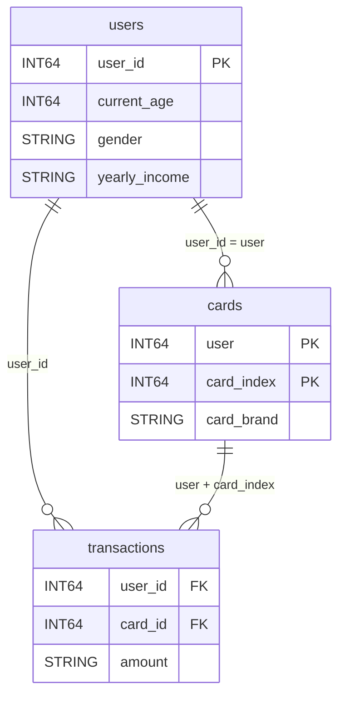

# 3주차. 거래에 고객과 카드의 맥락 붙이기

> 2026년 10월 16일 금요일 20:00–22:00. 오늘의 질문은 “누가 어떤 카드를 통해 소비했는가?”입니다. 결과가 그럴듯해도 조인으로 거래가 늘어나거나 사라졌다면 해석을 시작할 수 없습니다.

[실습으로 이동](lab.md) / [과제](assignment.md) / [데이터 사전](../data-guide.md)

## 오늘 만들 결과

- (1) 세 테이블의 한 행과 연결 키를 설명합니다.
- (2) 조인 전후 행 수, 거래액, 누락을 검사합니다.
- (3) 연령대와 성별 소비 패턴, 관측 기간에 사용되지 않은 카드, 소득 구간별 객단가를 구합니다.
- (4) AI가 만든 조인 조건을 작은 반례와 전체 검증으로 고칩니다.

| 시간 | 활동 | 직접 실습 |
| --- | --- | --- |
| 20:00–20:10 | 지난주 지표 정의 복습, 오늘의 질문 | |
| 20:10–20:25 | ERD, 복합 키, INNER와 LEFT | |
| 20:25–20:45 | 키 중복 여부과 조인 전후 숫자 비교 | 20분 |
| 20:45–20:50 | 휴식 | |
| 20:50–21:15 | 연령대와 성별 분석, 사용되지 않은 카드 | 25분 |
| 21:15–21:35 | 소득 구간 분석과 AI 쿼리 수정 | 20분 |
| 21:35–21:50 | 짝 리뷰, 프로젝트 주제 후보 작성 | 15분 |
| 21:50–22:00 | 결과 공유와 다음 주 연결 | |

실습과 리뷰는 총 80분입니다. 수업 시작 전 [환경 준비](../setup.md)와 2주차 지표 정의서를 열어 둡니다. 오늘은 SELECT와 CTE만 사용합니다.

## 1. 조인 전에 “한 행”을 말하기

거래 표의 한 줄은 거래 1건, 고객 표의 한 줄은 고객 1명, 카드 표의 한 줄은 한 고객이 가진 카드 1장입니다. 조인(JOIN)은 공통 번호를 찾아 두 표의 정보를 붙이는 일입니다. 예를 들어 거래의 고객 번호를 고객 표에서 찾아 나이를 붙일 수 있습니다.



`card_index=0`은 전체 고객을 통틀어 한 장을 뜻하지 않습니다. 각 고객 안의 카드 번호이므로 고객 번호와 함께 써야 합니다. 이처럼 고객 번호와 카드 번호를 함께 써야 카드 한 장을 구별할 수 있습니다. 여러 열을 묶어 구별하는 번호를 ‘복합 키’라고 합니다. 거래에는 고유 `transaction_id`가 제공되지 않으므로 없는 ID를 만들어 중복 제거의 근거로 쓰지 않습니다.

```sql
-- 고객 속성 연결
LEFT JOIN `finda-13-2026.tabformer.users` AS u
    ON t.user_id = u.user_id
-- 카드 속성 연결: 두 조건이 한 세트입니다.
LEFT JOIN `finda-13-2026.tabformer.cards` AS c
    ON t.user_id = c.user
    AND t.card_id = c.card_index
```

이 조각은 키를 읽는 예시입니다. 실행 가능한 전체 쿼리는 [실습](lab.md)에 있습니다. 읽기 프로젝트는 `finda-13-2026`으로 준비할 예정이며 실제 테이블과 권한 상태는 [환경 준비](../setup.md)에서 확인합니다.

## 2. 손으로 확인하는 팬아웃

다음은 **교육용 가상 데이터**입니다. 실제 TabFormer 결과가 아닙니다.

| 거래의 고객 번호 | 거래의 카드 번호 | 금액 |
| --- | --- | ---: |
| 10 | 0 | 100 |
| 10 | 1 | 50 |

| 카드의 고객 번호 | 카드 번호 |
| --- | --- |
| 10 | 0 |
| 10 | 1 |

고객 번호만 연결하면 거래 하나가 카드 두 장에 각각 붙습니다. 원래 2행, 합계 150이 4행, 합계 300이 됩니다. 이를 팬아웃이라고 부릅니다. 같은 고객이라는 사실만으로 어떤 카드를 썼는지 결정할 수 없기 때문에 생깁니다.

<details markdown="1">
<summary>가상 데이터로 직접 확인하는 SQL</summary>

```sql
WITH tx AS (
    SELECT 10 AS user_id, 0 AS card_id, NUMERIC '100' AS amount_usd
    UNION ALL
    SELECT 10, 1, NUMERIC '50'
), cards AS (
    SELECT 10 AS user_id, 0 AS card_id
    UNION ALL
    SELECT 10, 1
), wrong_join AS (
    SELECT t.amount_usd
    FROM tx AS t
    LEFT JOIN cards AS c ON t.user_id = c.user_id
), correct_join AS (
    SELECT t.amount_usd
    FROM tx AS t
    LEFT JOIN cards AS c
        ON t.user_id = c.user_id AND t.card_id = c.card_id
)
SELECT '고객만 연결' AS method, COUNT(*) AS row_count, SUM(amount_usd) AS amount
FROM wrong_join
UNION ALL
SELECT '고객과 카드 연결', COUNT(*), SUM(amount_usd)
FROM correct_join;
```

</details>

`SELECT DISTINCT`는 조인 조건을 고치지 않습니다. 금액이 같은 정상 거래도 존재하므로 결과에서 같은 값만 지우면 또 다른 손실을 만들 수 있습니다. 먼저 키와 테이블의 한 행을 확인합니다.

## 3. INNER와 LEFT는 분석 대상을 바꾼다

`INNER JOIN`은 양쪽 키가 일치한 행만 남깁니다. `LEFT JOIN`은 왼쪽 행을 남기고, 일치하는 오른쪽 행이 없으면 오른쪽 열을 NULL로 채웁니다. 오른쪽에 같은 키가 여러 행이면 LEFT도 행을 늘릴 수 있습니다. [GoogleSQL 조인 문법](https://docs.cloud.google.com/bigquery/docs/reference/standard-sql/query-syntax#join_types)

거래를 기준으로 고객 속성을 붙일 때는 LEFT로 시작하면 누락된 고객 정보를 볼 수 있습니다. 이때 `WHERE u.gender = 'Female'`을 뒤에 두면 성별 정보가 없는 행은 제외됩니다. “LEFT를 썼으니 모두 남는다”라고 생각하면 안 됩니다.

분석 목적이 여성 고객만 보기라면 필터 자체는 가능하지만, 전체 거래와 비교하는 검증은 필터 적용 **전**에 해야 합니다. 전체 보존 검사와 특정 집단 분석을 분리합니다.

## 4. 조인 검증은 네 개의 질문

| 질문 | 확인 방법 | 통과 기준 |
| --- | --- | --- |
| 오른쪽 키가 유일한가? | users 단일 키, cards 복합 키별 COUNT | 중복 키 0개, 키 NULL 0개 |
| 거래가 늘었거나 줄었는가? | 동일 기간과 금액 조건에서 전후 COUNT | LEFT JOIN으로 정보를 붙였다면 행 수 동일 |
| 거래액이 보존되는가? | 전후 SUM(amount_usd) | 차이 0; 입력이 비어 있으면 원인 확인 |
| 붙지 않은 행이 있는가? | 오른쪽 키 IS NULL인 거래 수 | 실제 수와 이유 기록, 임의 삭제 금지 |

행 수와 합계가 둘 다 맞아도 “조인이 완벽하다”는 증명은 아닙니다. 누락된 속성이 NULL로 남았는지, 잘못된 카드 속성이 연결되었는지 표본도 확인합니다. 숫자 하나만 통과시키지 않습니다.

## 5. 그룹 이름에도 정의가 필요하다

`current_age`는 고객 정보를 저장할 때의 나이입니다. 특정 시점의 상태를 저장한 자료를 ‘스냅샷’이라고 합니다. 2018년 거래를 분석하더라도 “2018년 당시 나이”라고 쓰지 않습니다. 나이가 NULL 또는 음수이면 연령 미상으로 둡니다. 성별이 없으면 미상으로 표시합니다.

소득 문자열은 거래 금액과 마찬가지로 `$`와 쉼표를 제거한 뒤 `SAFE_CAST`합니다. 변환 실패를 0으로 채우면 미상 고객을 저소득 집단에 잘못 넣게 됩니다. 구간 경계는 결과를 보고 유리하게 바꾸지 말고 먼저 [지표 정의서](../templates/metric-spec.md)에 기록합니다.

객단가는 이 수업에서 **순거래액 / 유효 금액 거래 건수**입니다. 환불인 음수 거래도 포함하므로 고객의 평균 구매 가격과 같다고 단정할 수 없습니다. 소득 구간별 객단가가 다르다는 관찰은 소득이 소비를 유발했다는 인과 결론이 아닙니다.

## 6. AI가 쓴 조인을 검증하는 순서

AI에 열 이름과 값의 종류, 분석 기간, 금액을 숫자로 바꾸는 방법을 알려 줍니다. 고객 번호와 카드 번호를 함께 연결해야 한다는 점과 결과 한 줄에 무엇을 보여 줄지도 적습니다. 개인별 거래 행을 붙여 넣을 필요는 없습니다. [AI 검증 기록](../reference/ai-verification.md)에 생성문과 수정문을 남깁니다.

```text
transactions의 한 행은 거래 1건이며 고유 transaction_id는 없습니다.
users는 user_id가 유일하고 cards는 (user, card_index)가 유일해야 합니다.
transactions.card_id는 cards.card_index와 연결합니다.
2018년 유효 금액 거래 중 errors가 NULL 또는 빈 문자열인 행을 분석합니다.
이 조건은 수업의 수업에서 승인을 판단하는 기준입니다. 환불은 순거래액에 포함합니다.
고객과 카드 속성을 LEFT JOIN으로 붙이는 SQL과
키 중복, 조인 전후 행 수 및 합계, 연결 실패를 검사하는 SQL을 제안하세요.
모르는 열은 만들지 말고 확인할 항목으로 남기세요.
```

AI가 제안한 `ON t.user_id = c.user` 한 줄을 발견했다면 “틀렸어요”라고 끝내지 않습니다. 가상 데이터의 2행→4행 반례, 실제 데이터 검증 결과, 복합 키 수정 후 결과를 한 묶음으로 기록합니다.

## 7. 오늘의 프로젝트 후보

짝 또는 팀으로 “어떤 집단의 어떤 지표를 어느 기간에 비교할지” 한 문장을 작성합니다. 예를 들면 “2018년 채널별 순거래액 변화가 어떤 MCC에서 크게 나타났는가?”입니다. 연령과 성별은 집단의 관찰된 패턴을 설명하는 용도로 한정하고 개인 심사나 차별적 제안의 근거로 삼지 않습니다.

개인 SQL과 검증 기록을 유지하면서 팀이 공동 리뷰와 발표를 하는 운영안을 사용할 수 있습니다. 최종 팀 구성과 제출 방식은 강사 안내를 확인합니다. [프로젝트 안내](../project.md)에 질문, 지표, 필요한 테이블을 먼저 남깁니다.

## 오늘의 핵심

조인은 열을 붙이는 작업이면서 분석 대상과 행 수를 바꾸는 작업입니다. 연결에 쓴 번호가 겹치지 않는지, 거래 수와 금액이 그대로인지, 정보를 붙이지 못한 거래는 몇 건인지 확인한 다음 결과를 설명합니다. 다음 주에는 이렇게 연결한 결과를 월과 그룹으로 나눠 변화가 나타난 위치를 찾습니다.

## 출처

- 제공 강의계획서, 3주차 “여러 테이블 조인”.
- [GoogleSQL 조인 문법](https://docs.cloud.google.com/bigquery/docs/reference/standard-sql/query-syntax#join_types).
- [IBM TabFormer](https://github.com/IBM/TabFormer): 본 수업의 합성 카드 거래 데이터 출처.
