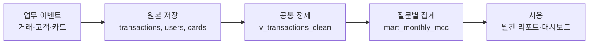
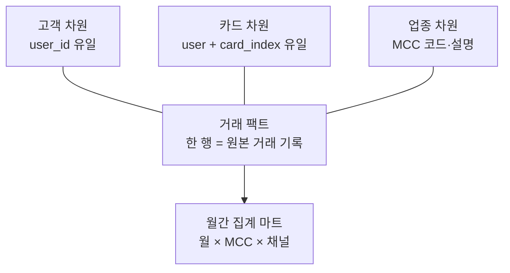

# 5주차 · 같은 질문에 같은 답을 주는 데이터 마트

2026년 10월 30일 금요일, 20:00–22:00 · 120분

[실습](lab.md) · [과제](assignment.md) · [데이터 안내](../data-guide.md) · [프로젝트](../project.md)

## 오늘 해결할 질문

> 매주 월별·업종별 소비를 다시 확인해야 한다면, 어디까지 미리 만들어 두는 것이 좋을까요?

지난주까지는 질문마다 SQL을 작성했습니다. 이번 주에는 반복되는 정제와 집계를 이름 있는 데이터 자산으로 만듭니다. 목표는 SQL의 줄 수를 줄이는 데 그치지 않습니다. 다른 사람이 실행해도 같은 지표가 나오고, 비용과 갱신 시점을 설명할 수 있어야 합니다.

수업을 마치면 다음을 할 수 있습니다.

- 뷰와 저장 테이블의 차이를 데이터 갱신과 처리 바이트 관점에서 설명한다.
- 한 행의 의미인 그레인을 먼저 정하고 월간 소비 마트를 만든다.
- 파티션과 클러스터가 도움이 되는 조회 조건을 구별한다.
- 원본·뷰·마트의 결과가 같은지 검증한 뒤 처리 바이트를 비교한다.
- AI의 리팩터링 제안을 검증 기록과 함께 채택하거나 거절한다.

## 120분의 흐름

| 시간 | 활동 | 직접 실습 |
| --- | --- | --- |
| 20:00–20:12 | 반복 보고 문제, OLTP·OLAP·그레인 | — |
| 20:12–20:22 | 뷰·CTAS·저장 구조 설명 | — |
| 20:22–20:42 | 실습 A: 정제 뷰와 품질 확인 | 20분 |
| 20:42–21:07 | 실습 B: 월간 마트 구축과 검증 | 25분 |
| 21:07–21:12 | 휴식 | — |
| 21:12–21:32 | 실습 C: 원본·뷰·마트 비용 비교 | 20분 |
| 21:32–21:47 | 실습 D: AI 리팩터링과 반례 확인 | 15분 |
| 21:47–22:00 | 결과 해석, 프로젝트 마트 설계 리뷰 | — |

직접 실습은 80분입니다. 선택 Silver 테이블 실습은 진행 속도가 빠른 학습자 또는 과제 확장용입니다.

## 1. 운영을 기록하는 일과 분석하는 일

OLTP는 결제 한 건, 주소 변경 한 건처럼 업무를 빠짐없이 기록하는 데 초점을 둡니다. OLAP는 많은 기록을 묶어 월별 변화나 업종별 차이를 읽는 데 초점을 둡니다. 같은 데이터를 사용해도 좋은 저장 구조와 자주 실행하는 질문이 다릅니다.

| 관점 | OLTP: 업무 처리 | OLAP: 분석 |
| --- | --- | --- |
| 질문 | 이 결제가 등록되었는가? | 이번 달 순거래액은 어디서 변했는가? |
| 주로 다루는 범위 | 특정 거래 또는 고객 | 기간과 여러 세그먼트 |
| 중요한 특성 | 개별 기록의 정합성, 빠른 변경 | 집계 정의의 일관성, 읽기 효율 |
| 수업에서의 위치 | 원천 업무를 이해하는 배경 | BigQuery에서 수행하는 집계 |

이 수업의 TabFormer는 합성 카드 거래 데이터입니다. 실제 금융기관의 운영 시스템을 조회하는 것은 아닙니다. 다음 도식은 실무 구조를 이해하기 위한 개념도입니다.



## 2. 한 행의 의미를 먼저 말하기

그레인은 “이 테이블의 한 행은 무엇인가?”에 대한 답입니다. 컬럼 목록을 쓰기 전에 문장으로 정합니다.

오늘 마트의 한 행은 **2018년의 특정 월 × MCC × 채널 조합에 속한 유효 금액 거래의 집계**입니다. 승인으로 보는 조건은 `errors IS NULL OR TRIM(errors) = ''`입니다. 이것은 수업에서 정한 분석용 정의이며 실제 승인 상태와 동일하다고 단정하지 않습니다.

| 컬럼 | 의미 | 다시 합쳐도 되는가? |
| --- | --- | --- |
| `tx_month` | 거래일을 해당 월의 1일로 변환한 DATE | 차원 |
| `mcc` | 업종 식별 코드 | 차원 |
| `channel` | 온라인·오프라인·미분류 | 차원 |
| `amount_usd` | 음수 환불을 포함한 순거래액 | SUM 가능 |
| `txn_count` | 유효 금액이며 범위·승인 조건을 만족하는 거래 건수 | SUM 가능 |
| `fraud_count` | 같은 범위에서 사기 라벨이 TRUE인 건수 | SUM 가능 |
| `fraud_labeled_count` | 같은 범위에서 사기 라벨을 아는 건수 | SUM 가능 |

`txn_count`는 마트의 행 수가 아닙니다. 마트에 온라인·오프라인 두 행이 있어도 그 안에는 여러 건의 거래가 들어 있습니다. 대시보드의 `Record Count`로 거래 건수를 대체하면 집계 행 개수를 세는 오류가 생깁니다.

### 작은 예시로 그레인 확인하기

아래는 원본 결과가 아닌 **교육용 가상 데이터**입니다. 금액은 USD입니다.

| 월 | MCC | 채널 | 순거래액 | 거래 건수 | 사기 건수 | 라벨 확인 건수 |
| --- | --- | --- | ---: | ---: | ---: | ---: |
| 2018-01-01 | 5411 | 온라인 | 200 | 2 | 1 | 2 |
| 2018-01-01 | 5411 | 오프라인 | 800 | 8 | 0 | 8 |
| 2018-01-01 | 5812 | 온라인 | 300 | 3 | 0 | 2 |

첫째 행의 사기율은 1/2, 둘째 행은 0/8입니다. MCC 5411 전체의 사기율은 `(1 + 0) / (2 + 8)`입니다. 두 비율의 단순 평균인 `(50% + 0%) / 2`가 아닙니다. 비율의 분모가 서로 다르기 때문입니다.

이와 같은 이유로 마트에는 사기율만 저장하기보다 분자와 분모를 보관합니다. 객단가도 `SUM(amount_usd) / SUM(txn_count)`로 계산합니다. 실제로 더 넓은 범위를 조회할 때는 `SAFE_DIVIDE`를 사용해 분모가 0인 경우를 NULL로 남깁니다.

활성 고객 수는 더 까다롭습니다. 같은 사람이 온라인과 오프라인을 모두 이용하면 각 채널의 고유 고객 수를 더할 때 중복됩니다. 오늘 마트에 `user_count`를 넣지 않는 이유입니다. 월 전체 활성 고객 수가 필요하면 거래 단위 데이터에서 그 범위의 `COUNT(DISTINCT user_id)`를 별도로 계산해야 합니다.

## 3. 스타 스키마를 읽는 방법

팩트는 거래처럼 측정 대상이 되는 사건과 금액입니다. 차원은 고객·카드·업종처럼 “무엇으로 나누어 볼 것인가”를 설명합니다. 팩트를 여러 차원이 둘러싼 형태를 스타 스키마라고 부릅니다.



원본에는 고유 `transaction_id`가 없습니다. 임의 컬럼 하나를 거래 키로 간주하거나 `DISTINCT`로 겉보기 중복을 없애지 않습니다. MCC 설명표도 원본 세 테이블에 포함되어 있다고 가정하지 않습니다. 별도 코드표를 붙인다면 코드 유일성과 기준 시점을 확인해야 합니다.

이번 마트는 연령대·성별·카드 브랜드를 모두 넣지 않습니다. 현재 답할 질문에 필요한 차원만 담습니다. 연령별 질문을 추가하려면 새 그레인과 고객 조인 검증을 설계하고, `current_age`는 거래 당시 나이가 아니라 스냅샷 나이라는 한계를 남깁니다.

## 4. 뷰와 CTAS는 무엇을 저장하는가?

논리 뷰는 SQL 정의를 이름으로 저장합니다. `SELECT ... FROM 뷰`를 실행하면 그 정의에 따라 원본을 조회합니다. 복잡한 정제식을 공통으로 쓰기에 좋지만 결과 테이블을 미리 저장한 것은 아닙니다.

CTAS는 `CREATE TABLE ... AS SELECT ...`의 줄임말입니다. SELECT의 결과를 테이블로 저장합니다. 나중에 조회할 때는 저장된 결과를 읽지만, 원본이 바뀌었다고 결과가 자동 갱신되지는 않습니다.

| 구분 | 정제 뷰 | 집계 테이블 |
| --- | --- | --- |
| 저장하는 것 | 쿼리 정의 | 실행 시점의 결과 |
| 쓰임 | 정제식과 컬럼 의미 통일 | 반복되는 집계를 미리 계산 |
| 원본 변경 반영 | 조회할 때 원본 기준 | 재생성 또는 갱신 작업 필요 |
| 비용 판단 | 원본 읽기가 다시 일어날 수 있음 | 생성·저장·반복 조회를 함께 계산 |
| 주의점 | 뷰 자체가 비용 절감을 보장하지 않음 | 낡은 결과를 최신이라고 표시하지 않기 |

논리 뷰와 materialized view는 별도 기능입니다. 오늘의 `v_transactions_clean`은 논리 뷰이고, `mart_monthly_mcc`는 CTAS로 만든 일반 저장 테이블입니다.

### 정제 로직의 핵심

```sql
SAFE_CAST(REPLACE(REPLACE(amount, '$', ''), ',', '') AS NUMERIC)
```

달러 기호와 쉼표를 제거하고 숫자로 변환합니다. 변환 실패는 NULL입니다. `COALESCE(..., 0)`를 자동으로 덧붙이면 “값을 모름”을 “거래액이 0”으로 바꾸므로 사용하지 않습니다.

```sql
SAFE.PARSE_DATE(
  '%Y-%m-%d',
  FORMAT('%04d-%02d-%02d', year, month, day)
)
```

날짜가 불가능한 조합이면 NULL로 남깁니다. 월별 집계는 이 정제 날짜를 `DATE_TRUNC(tx_date, MONTH)`로 월초에 맞춰 묶습니다. 정제 뷰에는 전체 기간을 남기고, 2018년 분석 범위와 유효 금액 조건은 마트를 만드는 단계에서 명시합니다.

뷰 생성 전체 SQL과 생성 뒤 품질 검사는 [실습 A](lab.md)에 있습니다. 쓰기는 자신의 `YOUR_PROJECT.bdai13`에서 하고, 강사 공유 원본인 `finda-13-2026.tabformer`는 읽기 대상으로만 사용합니다.

## 5. 파티션과 클러스터: 필요한 범위를 읽게 하기

파티션은 테이블을 날짜 등 기준으로 나누는 저장 구조입니다. 해당 파티션 컬럼에 적절한 조건이 있으면 관련 없는 구간을 건너뛸 수 있습니다. 월별 분석이 중심인 오늘은 월 단위 분할을 사용합니다.

클러스터는 지정한 컬럼의 값을 기준으로 저장 블록을 정리하는 방식입니다. 예를 들어 `CLUSTER BY mcc, channel`인 테이블에서 특정 MCC를 자주 조회하면 읽을 블록을 줄일 가능성이 있습니다. 컬럼 순서도 중요합니다.

```sql
CREATE OR REPLACE TABLE `YOUR_PROJECT.bdai13.mart_monthly_mcc`
PARTITION BY DATE_TRUNC(tx_month, MONTH)
CLUSTER BY mcc, channel
AS
SELECT
  DATE_TRUNC(tx_date, MONTH) AS tx_month,
  mcc,
  channel,
  SUM(amount_usd) AS amount_usd,
  COUNT(*) AS txn_count,
  COUNTIF(fraud_flag) AS fraud_count,
  COUNTIF(fraud_flag IS NOT NULL) AS fraud_labeled_count
FROM `YOUR_PROJECT.bdai13.v_transactions_clean`
WHERE tx_date >= DATE '2018-01-01'
  AND tx_date < DATE '2019-01-01'
  AND amount_usd IS NOT NULL
  AND approved_for_analysis
GROUP BY tx_month, mcc, channel;
```

`CREATE OR REPLACE`는 같은 이름의 자신의 연습 테이블이 있으면 결과를 교체합니다. 검토가 끝난 최종 마트는 스크립트와 생성 시점을 함께 기록합니다. 같은 이름을 여러 사람이 공동으로 덮어쓰는 방식은 피합니다.

교육 목적으로 작은 마트에도 파티션과 클러스터 문법을 적용하지만, 이것이 항상 최선이라는 뜻은 아닙니다. 작은 테이블에서는 차이가 거의 없을 수 있습니다. 실제 저장 크기·조회 패턴·갱신 방식에 근거해 설계를 선택합니다.

클러스터 테이블은 실행 전 예상 바이트만으로 절감 폭을 정확하게 판단하기 어렵습니다. 실행 후 처리 바이트와 캐시 사용 여부를 함께 기록해야 합니다. 자세한 원리는 [BigQuery 클러스터 테이블 문서](https://docs.cloud.google.com/bigquery/docs/clustered-tables)를 참고합니다.

## 6. 비용 비교의 첫 조건은 결과가 같다는 것

다음 세 쿼리를 비교합니다.

1. 원본에서 정제하고 월별 집계하기.
2. 정제 뷰에서 같은 월별 집계하기.
3. 월간 마트의 가산 지표를 다시 월별로 합치기.

기간, 승인 정의, 환불, NULL 처리, 출력 컬럼이 같아야 합니다. 더 적은 컬럼과 더 짧은 기간을 읽는 다른 질문으로 바뀌었다면 공정한 비교가 아닙니다.

실행 전에는 예상 처리량과 최대 청구 바이트 설정을 확인합니다. 실행 후에는 작업 세부정보에서 실제 처리 바이트, 청구 바이트가 표시되면 그 값, 캐시 여부, 실행 시각을 기록합니다. 비용 안전장치 설정은 [시작 안내](../setup.md)를 따릅니다.

`LIMIT 10`은 출력 행을 줄이는 구문입니다. 일반적인 비클러스터 테이블에서 읽을 열의 전체 스캔을 줄인다고 보장하지 않습니다. `SELECT *`를 필요한 컬럼 목록으로 바꾸는 제안과 같은 효과로 취급하지 않습니다.

캐시 결과는 저장된 결과를 재사용하므로 0 처리 바이트처럼 보일 수 있습니다. 비용 비교는 같은 캐시 조건에서 수행하고, 필요하면 쿼리 설정에서 캐시 사용을 끈 뒤 실행합니다. 시간만 비교하면 공유 자원 상황과 캐시 영향을 데이터 구조의 효과로 오해할 수 있습니다.

원본 데이터량과 실제 처리 바이트는 수업 환경에서 측정합니다. 이 자료에는 측정하지 않은 절감률을 넣지 않습니다.

## 7. AI에게 맡길 부분과 직접 확인할 부분

AI는 중복 CTE 정리, 의미 있는 이름, 주석 초안에 도움을 줄 수 있습니다. 하지만 `DISTINCT`를 추가하거나 음수를 제거하는 것은 단순 정리가 아니라 분석 정의 변경입니다.

다음 프롬프트를 자신의 SQL과 함께 사용할 수 있습니다. 개인 식별 정보, 인증 정보, 실제 행 데이터는 붙여 넣지 않습니다.

```text
BigQuery GoogleSQL을 읽기 쉽게 리팩터링해 주세요.
출력 그레인은 월 × MCC × 채널입니다.
기간은 2018-01-01 이상 2019-01-01 미만입니다.
유효 금액 거래만 사용하며 음수 환불을 포함한 순거래액입니다.
approved_for_analysis 조건을 유지하세요.
사기 건수와 라벨 확인 건수를 별도로 유지하세요.
없는 transaction_id를 만들거나 DISTINCT로 거래를 지우지 마세요.
변경 목록, 결과가 같다고 판단한 근거, 검증 SQL을 제시하세요.
처리 바이트 절감은 측정하지 않았다면 추정이라고 표시하세요.
```

AI가 생성한 변경 목록과 원본 SQL을 나란히 읽습니다. 같은 결과인지 확인한 뒤 실행 계획과 바이트를 비교합니다. 의미가 바뀐 제안은 거절 사유까지 기록합니다. [AI 검증 기록](../reference/ai-verification.md)에 사용한 범위와 직접 검증한 방법을 남깁니다.

## 8. 다음 주 대시보드로 넘길 계약

다음 주에는 오늘 마트의 세 차원과 네 가산 지표를 사용합니다. 마트에 없는 고객별 상세, 일별 추이, 월 전체 고유 고객 수는 차트 설정만으로 복구할 수 없습니다.

마트와 함께 아래 정보를 전달합니다.

- 질문과 그레인, 분석 기간, 승인·환불·사기율 분모 정의.
- 생성 SQL, 생성 시점, 원본 기준 시점, 마지막 검증 결과.
- `tx_month`의 DATE 타입과 월초 의미, `mcc`가 코드라는 사실.
- 원본 직접 집계와 마트 재집계의 행·합계 일치 증거.
- 공개해도 되는 집계 범위와 공개 전 추가 검토할 항목.

개인 프로젝트를 진행하면서 팀 단위로 서로 검증하고 발표하는 운영안을 사용합니다. 개인·팀 제출 범위와 팀 편성은 [프로젝트 안내](../project.md)의 확정 공지를 따릅니다.

## 오늘 스스로 설명할 다섯 문장

- “우리 마트의 한 행은 …이다.”
- “뷰는 …을 저장하고, CTAS 테이블은 …을 저장한다.”
- “사기율을 다시 집계할 때 …를 더한 뒤 나눈다.”
- “이번 비용 비교는 …조건을 통제했다.”
- “AI 제안 중 …는 검증 결과 …여서 채택/거절했다.”

## 출처

- 제공 강의계획서, 5주차 「뷰와 데이터 마트: 반복 분석을 위한 기반 만들기」.
- [BigQuery 논리 뷰](https://docs.cloud.google.com/bigquery/docs/views-intro), [GoogleSQL DDL](https://docs.cloud.google.com/bigquery/docs/reference/standard-sql/data-definition-language).
- [파티션 테이블](https://docs.cloud.google.com/bigquery/docs/partitioned-tables), [클러스터 테이블](https://docs.cloud.google.com/bigquery/docs/clustered-tables), [비용 추정과 통제](https://docs.cloud.google.com/bigquery/docs/best-practices-costs).
- [IBM TabFormer](https://github.com/IBM/TabFormer). 기술 문서 확인: 2026-09-11.
