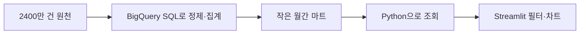

# 6주차 · 검증한 SQL을 Streamlit 앱으로 전달하기

2026년 11월 6일 금요일 20:00–22:00 · 120분

오늘은 “내가 확인한 숫자를 다른 사람도 같은 기준으로 읽을 수 있는가?”에 답합니다. Python 문법 전체를 배우기보다 완성된 앱을 실행하고 제목·필터·차트 한 부분씩 수정합니다. 최종 결과는 SQL·마트·검증 기록과 연결된 Streamlit 앱 URL입니다.

[실습](lab.md) · [최종 제출](assignment.md) · [연결 준비와 다운로드](../reference/dashboard-connection.md)

## 수업 진행

| 시간 | 활동 | 방식 |
| --- | --- | --- |
| 20:00–20:10 | 마트·앱·공개 범위 확인 | 설명 10분 |
| 20:10–20:25 | 준비된 기본 앱 연결 확인 | 실습 15분 |
| 20:25–20:50 | 제목·필터·차트 수정 | 실습 25분 |
| 20:50–21:10 | SQL 대조·동료 접근 확인 | 실습 20분 |
| 21:10–21:15 | 휴식 | 5분 |
| 21:15–21:43 | 7분 발표 × 4팀 | 발표 28분 |
| 21:43–21:53 | 개인정보와 공정성 토론 | 토론 10분 |
| 21:53–22:00 | 포트폴리오 정리 | 정리 7분 |

직접 실습은 60분입니다. 서비스 계정·GitHub·Community Cloud 준비는 5주차 과제 기간에 완료합니다. 수업 중 처음부터 계정 설정을 시작하면 발표 시간이 부족합니다. 팀 수가 4팀을 넘으면 별도 발표 시간을 공지합니다.

## 1. 화면 앞뒤에서 하는 일



BigQuery는 큰 데이터를 집계합니다. Python 코드는 그 작은 결과를 받아 화면에 맞게 전달하고, Streamlit은 필터·지표·차트를 표시합니다. 앱을 만든다는 이유로 원천 거래를 전부 다운로드하지 않습니다.

기본 경로는 BigQuery 직접 연결입니다. 인증 정책상 어려우면 Colab에서 집계 결과를 DuckDB 파일로 만들어 같은 앱이 읽게 합니다. 이 예비 경로는 저장 시점의 스냅샷입니다. [연결 안내](../reference/dashboard-connection.md)를 보고 자신의 경로와 갱신 방식을 설명할 수 있어야 합니다.

## 2. Python을 처음 보는 사람을 위한 세 문장

```python
st.title('카드 소비 리포트')
st.metric('거래 건수', 120)
st.line_chart(monthly, x='tx_month', y='amount_usd')
```

첫 줄은 제목, 둘째 줄은 숫자 하나, 셋째 줄은 표 `monthly`의 두 열을 차트로 표현합니다. **120은 함수 설명을 위한 가상 숫자**입니다. 실제 앱은 마트에서 집계한 값을 넣습니다. 함수 이름 뒤 괄호 안의 값을 바꾸면 표시가 달라집니다.

DataFrame은 Python에서 사용하는 표라고 이해하면 충분합니다. SQL 결과의 열이 Python 표의 열로 이어집니다. 대시보드 구현보다 지표 정의와 맞는 데이터를 선택하는 것이 먼저입니다.

## 3. 필터는 질문의 범위를 바꾼다

월·채널·업종 필터를 바꾸면 포함되는 마트 행이 달라집니다. 같은 조건을 SQL에도 적용해야 비교할 수 있습니다. 월간 마트에서 2018-03-15부터 2018-03-20까지처럼 일별 범위를 분석할 수는 없습니다. 원천보다 작아진 대신 상세 수준이 줄었습니다.

**가상 예시:** A그룹 금액100/건수2, B그룹 금액900/건수3이라면 전체 거래당 금액은 1000/5=200입니다. 각 그룹의 평균50과300을 다시 평균내면175가 됩니다. 앱에서 필터를 바꿀 때도 항상 분자 합÷분모 합으로 계산합니다.

사기 라벨 비율 역시 사기 건수 합÷라벨 확인 건수 합입니다. 라벨 분모가 없으면 0%가 아니라 계산 불가입니다. 활성 고객 수는 이번 월×MCC×채널 마트에 없으므로 임의로 표시하지 않습니다.

## 4. 차트는 질문에 맞게 선택한다

| 질문 | 기본 차트 | 독자가 확인할 것 |
| --- | --- | --- |
| 월별로 어떻게 달라졌는가? | 선 차트 | 날짜 순서·USD 단위·선택 기간 |
| 어떤 업종의 금액이 큰가? | 막대 차트 | MCC 코드·정렬·상위 항목 범위 |
| 선택 조건에서 규모는? | 지표 카드 | 금액과 건수, 분모 |

색상이나 애니메이션을 먼저 꾸미지 않습니다. 단위와 필터의 영향을 읽을 수 있어야 합니다. 라벨이 없는 MCC에 AI가 임의로 업종명을 붙이면 잘못된 정보가 됩니다. 월이 없으면 데이터가 없는 것인지 거래가 0인지 확인하고, 전월비는 월 달력 보완 뒤 계산합니다.

## 5. AI와 앱을 수정하는 방법

```text
아래 Streamlit 기본 앱에서 제목과 월별 차트만 수정해 줘.
학생은 Python 초급이야. 변경한 줄을 설명해 줘.
Secrets, 읽기 전용 집계 조회, cache_data, 최대 청구 바이트는 유지해 줘.
없는 컬럼·거래 결과·활성 고객 수를 만들지 마.
객단가와 사기율은 분자·분모를 합산한 뒤 계산해 줘.
```

수정 후에는 앱이 실행되는지만 확인하지 않습니다. 전체·한 달·한 채널 세 조건에서 SQL과 숫자를 대조합니다. 빈 필터와 라벨 분모 0도 어떻게 보이는지 확인합니다. AI에게 인증키를 제공할 필요는 없습니다.

## 6. 공개 앱의 데이터와 인증

사람의 로그인과 앱 서버의 서비스 계정은 다른 주체입니다. 앱은 서비스 계정의 권한으로 마트를 읽고, 방문자는 앱에서 공개한 집계값을 볼 수 있습니다. 키는 Streamlit Secrets에 넣고 공개 저장소에 올리지 않습니다. 큰 권한으로 문제를 해결하기보다 필요한 테이블의 조회 권한과 실행 프로젝트 권한을 확인합니다.

무료 Community Cloud도 자원·휴면 조건이 있습니다. BigQuery 무료 한도는 쿼리 실행 프로젝트에 적용됩니다. `cache_data`는 반복 조회를 줄이지만 한도를 무제한으로 바꾸지 않습니다. 처음 열 때의 앱 준비 시간, 자료 취득 시각, 갱신 주기를 설명하세요.

## 7. 금융 데이터와 AI 윤리 토론

사례 A: “고객 ID를 해시 처리했으니 거래 시각·지역·금액을 모두 공개해도 안전하다.” 다른 정보와 결합하면 누구인지 추정할 수 있으므로 해시만으로 안전을 확정할 수 없습니다. 공개 목적에 필요한 집계 범위와 작은 집단의 노출을 검토합니다.

사례 B: “한 연령대의 사기 라벨 비율이 높으니 그 연령대를 자동 차단하자.” 관측된 차이는 모수·사용 채널·합성 데이터 생성 방식의 영향일 수 있습니다. 실제 차별적 조치를 정당화하는 근거가 아닙니다. 관찰과 정책 결정을 연결할 때 필요한 추가 검증을 토론합니다.

합성 데이터로 분석 방법을 배우더라도 실제 고객 자료를 다룰 때의 최소 수집과 목적 제한을 함께 연습합니다.

## 오늘 남길 것

앱 URL, 앱과 SQL의 대조표, AI 수정 기록, 공개 범위, 연결 경로와 갱신 방식입니다. 7분 발표에서는 질문→정의→관찰→검증→한계의 흐름으로 설명합니다.

출처: 제공 강의계획서 6주차와 사용자 수정 지시. [Streamlit BigQuery](https://docs.streamlit.io/develop/tutorials/databases/bigquery), [무료 배포](https://docs.streamlit.io/deploy/streamlit-community-cloud), [Python 샌드박스](https://docs.cloud.google.com/bigquery/docs/quickstarts/quickstart-client-libraries).
